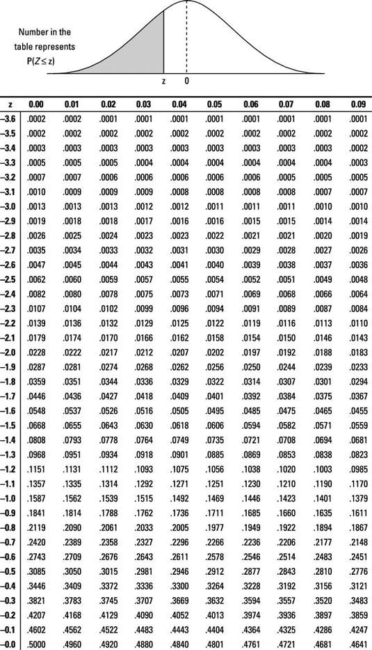
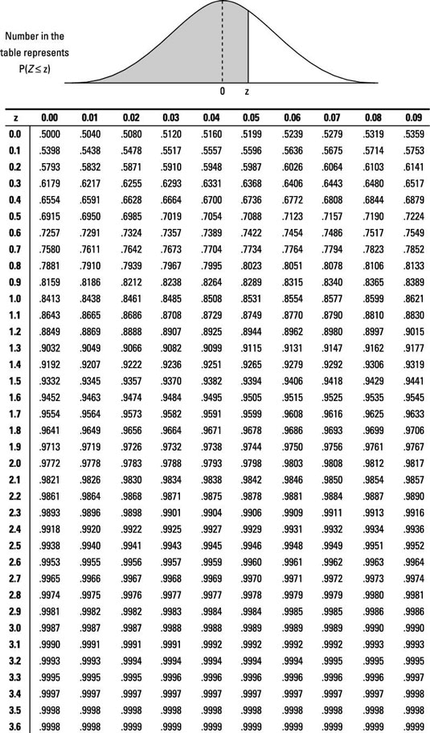

# Tabelle 1: negative z-Werte

# Tabelle 2: positive z-Werte

Quelle: [D.J. Rumsey: Statistics for Dummies](https://www.dummies.com/article/academics-the-arts/math/statistics/how-to-find-probabilities-for-z-with-the-z-table-169599/)