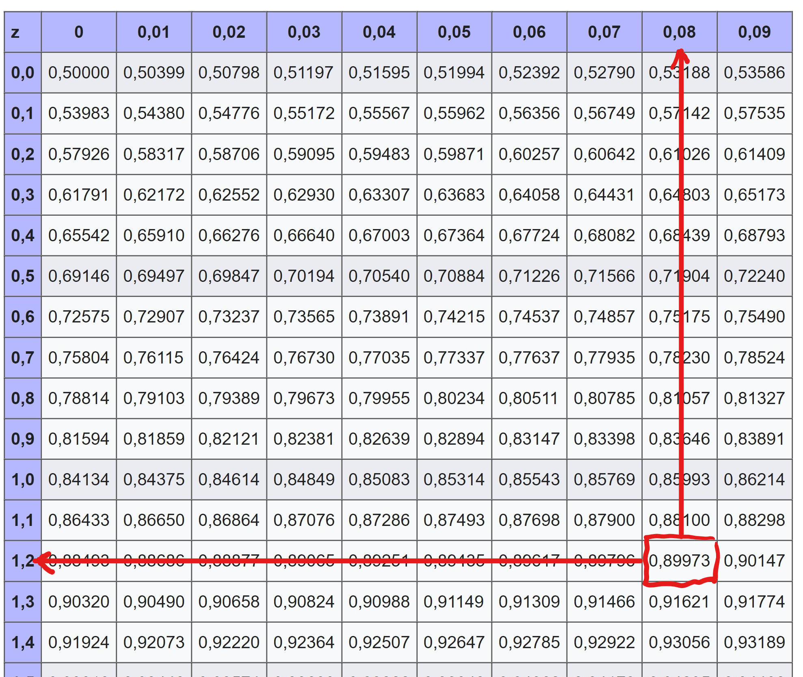

```{r setup, include=FALSE}
rm(list = ls())

knitr::opts_chunk$set(echo = FALSE, message = FALSE)

library(tidyverse)
library(jmv)
library(knitr)
library(kableExtra)
library(openintro)

data(COL)

phydata <- readr::read_csv("../data/physio.csv")
phydata$ID <- factor(phydata$ID)
phydata$Kohorte <- factor(phydata$Kohorte)
phydata$Klasse <- factor(phydata$Klasse)
phydata$Geschlecht <- factor(phydata$Geschlecht)
phydata$Augenfarbe <- factor(phydata$Augenfarbe)
```

{width=40%}


**Technischer Hinweis: Links in den Übungen öffnen Sie, indem sie darauf rechtsklicken und "Link in neuem Tab/Fenster öffnen" wählen.**   

<br>

# Wahrscheinlichkeiten  

Zum Aufwärmen ein paar einfache Übungen zu Wahrscheinlichkeiten

<br/>

## Übung 1 {.tabset}

### Aufgaben

1. Sie werfen einen 6-seitigen Würfel. Wie gross ist die Wahrscheinlichkeit, beim ersten Wurf eine 6 zu erhalten?    
2. Sie werfen den Würfel nochmals. Wie gross ist die Wahrscheinlichkeit, beim ersten Wurf keine 6 zu erhalten?  
3. Sie werfen den Würfel nochmals. Wie gross ist die Wahrscheinlichkeit, beim 2. Wurf eine 6 zu erhalten.  
4. Sie ziehen blind eine Karte aus einem Kartenspiel mit 36 Karten. Wie gross ist die Wahrscheinlichkeit, dass Sie Herz-As ziehen?  
5. Sie ziehen blind eine Karte aus einem Kartenspiel mit 36 Karten. Wie gross ist die Wahrscheinlichkeit, dass Sie kein Herz-As ziehen?  

<br/>

### Lösungen 

1. Sie werfen einen 6-seitigen Würfel. Wie gross ist die Wahrscheinlichkeit, beim ersten Wurf eine 6 zu erhalten? 

  * Die Wahrscheinlichkeit für jede Seite beträgt p = 1/6; sie ist für jede Seite gleich gross. Damit beträgt die Wahrscheinlichkeit für eine 6 p = 1/6 = ca. 17%  

2. Sie werfen den Würfel nochmals. Wie gross ist die Wahrscheinlichkeit, beim ersten Wurf keine 6 zu erhalten?    

  * Sie werden in jedem Fall eine Zahl zwischen 1 und 6 werfen, etwas anderes gibt es nicht. Die Gesamtwahrscheinlichkeit addiert sich zu  
  $$P = 1/6 (für 1) + 1/6 (für 2) + 1/6 (für 3) + 1/6 (für 4) + 1/6 (für 5) + 1/6 (für 6) = 1$$
  
  * Die Wahrscheinlichkeit, keine 6 zu würfeln beträgt also 
  
  $$P(\neq 6) = 1/6 (für 1) + 1/6 (für 2) + 1/6 (für 3) + 1/6 (für 4) + 1/6 (für 5) = 5/6 \approx 83\%$$
  
  * Einfacher geht es so: $P = 1 - P(6) = 1 - 1/6 = 5/6$   
  
3. Sie werfen den Würfel nochmals. Wie gross ist die Wahrscheinlichkeit, beim 2. Wurf eine 6 zu erhalten.  

  * Die Wahrscheinlichkeit beträgt immer noch p = 1/6. Die Wahrscheinlichkeit hat ja kein Gedächtnis und erinnert sich nicht daran, dass Sie schon einmal eine 6 gewürfelt haben.   
  * Eine andere Frage wäre: Wie gross ist die Wahrscheinlichkeit, bei 2 Würfen zweimal hintereinander eine 6 zu erhalten. In diesem Fall ist $P(6|6) = 1/6 \times 1/6 = 1/36$.  
  * P(6|6) bezeichnen wir als *bedingte Wahrscheinlichkeit* weil die Bedingung für den zweiten Wurf durch den ersten Wurf definiert ist. Auch der p-Wert beim Hypothesenprüfen in der Statistik ist eine bedingte Wahrscheinlichkeit: Er gibt an, wie gross die Wahrscheinlichkeit für ein Ereignis ist unter der Bedingung, dass die Nullhypothese wahr ist. Aber wir greifen jetzt etwas vor, das kommt später ;)  

4. Sie ziehen blind eine Karte aus einem Kartenspiel mit 36 Karten. Wie gross ist die Wahrscheinlichkeit, dass Sie Herz-As ziehen? 

  * Bei 36 Karten beträgt die Wahrscheinlichkeit, eine bestimmte Karte zu ziehen $P = 1/36$  
  
5. Sie ziehen blind eine Karte aus einem Kartenspiel mit 36 Karten. Wie gross ist die Wahrscheinlichkeit, dass Sie kein Herz-As ziehen, also eine x-beliebige andere Karte? $P = 1 - 1/36 = 35/36$  
  
<br/>

# Normalverteilung und z-Werte

In den folgenden Übungen arbeiten wir mit dem bereits bekannten Datensatz `physio.csv`, der Daten von 228 Studierenden der Physiotherapie enthält. Wenn Sie den Datensatz bei den Übungen zur deskriptiven Statistik als `physio.omv` gespeichert haben, sind die Variablen bereits kategorisiert und Sie arbeiten mit diesem Datensatz, andernfalls laden Sie `physio.csv`in **jamovi** und kategorisieren als erstes die Variablen wie in den Übungen zur deskriptiven Statistik beschrieben.    


## Kurze Einführung

### Wie gross sind die Studentinnen?

Als erstes verschaffen wir uns einen Überblick zu den Kennzahlen der Körpergrösse der Studentinnen und stellen diese in einem Histogramm dar.

```{r, fig.align='center'}
phy_w <- phydata %>% 
    filter(Geschlecht == "w")

phy_w %>% 
    summarise(
        n = n(),
        m = mean(Groesse),
        median = median(Groesse),
        s = sd(Groesse),
        min = min(Groesse),
        max = max(Groesse)
    ) %>% 
    kbl(digits = 2, caption = "Kennzahlen zu Studentinnen PHY13-PHY17") %>% 
  kable_minimal(full_width = FALSE)

phy_w %>% 
    ggplot(., aes(x = Groesse)) +
    geom_histogram(aes(y = after_stat(density)), 
                   bins = 15, fill = "skyblue", color = "white") +
    stat_function(fun = dnorm, 
                  args = list(mean = mean(phy_w$Groesse), sd = sd(phy_w$Groesse)),
                  color = "red", linewidth = 1) +
    ggtitle("Groesse der Studentinnen in cm") +
  ylab("")
```
   
Anleitung für **jamovi**:   

Wir arbeiten mit einem Teildatensatz für Studentinnen. Dazu müssen wir unsere Daten Filtern. Das geht folgendermassen: **jamovi** > Register *Data* > Menüband *Filters* > im Fenster geben sie **= Geschlecht == "w"** ein und schliessen mit der Enter/Return-Taste ab. Im Tabellenfenster links ist eine neue Spalte mit der Bezeichnung `Filter 1` erschienen. Bei den Frauen (`Geschlecht` == "w") sollte in dieser Spalte ein grünes Häckchen und bei den Männern (`Geschlecht`== "m") ein rotes X eingetragen sein.    

Hilfe zum Filtern von Daten bieten diese Video-Tutorials  

- [jamovi Tutorial: Filter setzen (youtube, Deutsch, 9'46")](https://youtu.be/Jvr5Eo9xJk4)  
- [Filtering cases - jamovi (youtube, Englisch, 8'25")](https://youtu.be/pij0KlFhITw)  

Wenn der Filter gesetzt ist, können Sie die Kennzahlen und das Histogramm (ohne Normalverteilungskurve) in **jamovi** erstellen, wie wir das bei den Übungen zur deskriptiven Statistik gelernt haben.

<br>
   
### Repetition: Umwandlung der Verteilung in eine Standard-Normalverteilung

Die Standardnormalverteilung ist gekennzeichnet durch den Mittelwert 0 und die Standardabweichung 1. Die Umwandlung einer beliebigen Verteilung erfolgt nach der Formel:

$$z_n=\frac{x_n-\bar{x}}{s}$$

**Beispiel:** (Mittelwert und Standardabweichung siehe Tabelle oben)

$$z_n=\frac{x_n-166.92}{5.66}$$


```{r, fig.align='center'}
phy_w <- phy_w %>% 
    mutate(
        Groesse_std = (Groesse- mean(Groesse))/sd(Groesse)
    )

phy_w %>% 
    ggplot(., aes(x = Groesse_std)) +
    geom_histogram(aes(y = after_stat(density)), 
                   bins = 15, fill = "skyblue", color = "white") +
    stat_function(fun = dnorm, 
                  args = list(mean = mean(phy_w$Groesse_std), 
                              sd = sd(phy_w$Groesse_std)),
                  color = "red", linewidth = 1) +
    ggtitle("Standardnormalverteilung der Groesse der Studentinnen PHY13-PHY17") +
    ylab("") +
    xlab("Standardisierte Grösse")
```
  
Wir sehen, dass das standardisierte Histogramm und die standardisierte Normalverteilungskurve genau gleich aussehen, wie mit den nicht transformierten Originaldaten. Was bringt uns das also?   
    
Wenn wir beliebige, normalverteilte Merkmale messen, werden wir immer wieder neue Normalverteilungen mit ihrem eigenen Mittelwert und ihrer eigenen Standardabweichung erhalten. D.h. die Normalverteilungskurve wird manchmal breiter, manchmal schmaler, manchmal höher, manchmal tiefer sein. Jedes beliebige Merkmal weist seine charakteristische Verteilung auf. In der Statistik interessieren wir uns oft für die Wahrscheinlichkeit, dass ein bestimmtes Ereignis eintritt (z.B. das Ereignis, dass eine Studentin 168 cm gross ist), und effektiv ist die Normalverteilung eine Wahrscheinlichkeitsverteilung. Die Berechnung von Wahrscheinlichkeiten erfolgt über die Berechnung von Flächeninhalten unter der Normalverteilungskurve wobei die gesamte Fläche unter der Kurve stets gleich 1 ist (Tönt kompliziert, ist es aber nicht. Wir werden das unten üben). Die Berechnung von Flächen unter Kurven ist tatsächlich eine nicht ganz triviale Angelegenheit. Um diese Berechnungen zu erleichtern, wurde die Standardnormalverteilung "erfunden". Die Standardisierung erfolgt über die Berechnung von sog. z-Werten. Die z-Werte-Tabelle ist ein Hilfsmittel, das es uns erlaubt, für beliebige Normalverteilungen beliebige Flächeninhalte und somit Wahrscheinlichkeiten zu berechnen.


### Arbeiten mit z-Werten

Uns interessiert jetzt die Frage *Wie gross ist die Wahrscheinlichkeit, dass eine Studentin eine bestimmte Körpergrösse aufweist?*. Aus hier nicht näher erläuterten Gründen ist es nicht möglich, diese Wahrscheinlichkeit exakt zu berechnen (sie wäre gleich Null). Was jedoch möglich ist, ist die Beantwortung der Frage *Wie gross ist die Wahrscheinlichkeit dass eine Studentin gleich gross oder grösser, bzw. kleiner ist?*.

**Beispiel:** Wie gross ist die Wahrscheinlichkeit, dass eine Studientin 163 cm gross oder kleiner ist?

$$z_{163} = \frac{163 - 166.92}{5.66} = -0.693$$

```{r, fig.align='center'}
phy_w %>% 
    ggplot(., aes(x = Groesse)) +
    stat_function(fun = dnorm, 
                  args = list(mean = mean(phy_w$Groesse), 
                              sd = sd(phy_w$Groesse)),
                  color = "red", linewidth = 1) +
    geom_vline(aes(xintercept = 163), color = "purple", linewidth = 1) +
    ggtitle("Groesse der Studentinnen PHY13-PHY17",
            subtitle = "Vertikale Linie bei 163 cm") +
    ylab("")
```


Die Wahrscheinlichkeit, dass eine Studentin 163 cm gross oder kleiner ist, entspricht der Grösse der Fläche unter der Kurve links von der violetten Linie. Wir können schon von blossem Auge sagen, dass die Wahrscheinlichkeit kleiner als 50% sein muss, da die violette Linie bei 163 cm die Fläche in eine kleinere linke und eine grössere rechte Fläche teilt.  


```{r, fig.align='center'}
phy_w %>% 
    ggplot(., aes(x = Groesse)) +
    geom_area(stat = "function", fun = dnorm, 
              args = list(mean = mean(phy_w$Groesse), sd = sd(phy_w$Groesse)), 
              fill = "skyblue", alpha = .5, xlim = c(145, 163)) +
    stat_function(fun = dnorm, 
                  args = list(mean = mean(phy_w$Groesse), 
                              sd = sd(phy_w$Groesse)),
                  color = "red", linewidth = 1) +
    geom_vline(aes(xintercept = 163), color = "purple", linewidth = 1) +
    ggtitle("Groesse der Studentinnen PHY13-PHY17",
            subtitle = "Vertikale Linie bei 163 cm") +
    ylab("")
```

Aber wie genau berechnet man jetzt die Grösse der blauen Fläche? Bevor Computerprogramme die Berechnung übernommen haben, hat man sich mit sogenannten z-Werte-Tabellen (siehe https://rpubs.com/BFH-PHY-WA/1007683) beholfen. Weil es unmöglich ist für alle möglichen Verteilungen  Tabellen zu berechnen, wurde die z-Transformation entwickelt. Damit lassen sich beliebige Normalverteilungen in eine standardisierte Verteilung umwandeln. Heute übernimmt diese Arbeit der PC, wir machen es hier aber von Hand, um zu verstehen, was da vorgeht. 

**Übung:** Welche Wahrscheinlichkeit gibt die Z-Wertetabelle für den z-Wert `r (163 - mean(phy_w$Groesse))/sd(phy_w$Groesse)` an?

```{r}
p_lowertail <- pnorm(163, mean = mean(phy_w$Groesse), sd = sd(phy_w$Groesse), lower.tail = TRUE)
```

Der Computer berechnet die Wahrscheinlichkeit, dass eine Studentin in PHY13-PHY17 163 cm oder kleiner ist mit p = `r p_lowertail`.

**Übung:** Wie gross ist die Wahrscheinlichkeit, dass eine Studentin 163 cm oder grösser ist?

Dies ist die Umkehrung der Frage. Da die Wahrscheinlichkeit dafür, dass die Studentin 163 cm oder kleiner ist jetzt bekannt ist, lässt sich die Frage ganz einfach beantworten, da bekanntlicherweise die Fläche unter der Kurve gleich 1 ist.

Lösung: Die Wahrscheinlichkeit, dass eine Studentin 163 cm oder grösser ist beträgt

$$1-(Wahrscheinlichkeit für \leq 163 cm) = 1-0.2403793$$
also p = `r 1-p_lowertail`.


## Übungen 

* Arbeiten Sie mit der [z-Werte-Tabelle](https://rpubs.com/BFH-PHY-WA/1007683) oder mit der R-Konsole in **jamovi**.  
* Alle Übungen werden mit dem Teildatensatz für Studentinnen (jamovi:Filter **= Geschlecht == "w"**) durchgeführt.  
* **Runden** Sie Kennzahlen und z-Werte auf zwei Stellen nach dem Komma, p-Werte auf drei Stellen nach dem Komma.   
* Für gewisse Übungen muss das Modul *Rj - Editor to run R code inside jamovi* installiert sein. Sie können dieses Modul über die Schaltfläche *Modules* (grosses Pluszeichen im Menüband) installieren. Wählen Sie *Modules* > *jamovi library* > *Rj - Editor to run R code inside jamovi* und das Modul wird installiert. Sie erkennen das nach der Installation am *R*-Symbol in der Menüleiste.  

## Übung 1 {.tabset}  

Ziel: $z$-Werte für Körpergrössen von Studentinnen berechnen     

### Aufgaben

1. Wie gross ist der $z$-Wert für die Körpergrösse 176.00 cm?
2. Wie gross ist der $z$-Wert für die Körpergrösse 166.92 cm?
3. Wie gross ist der $z$-Wert für die Körpergrösse 195.00 cm? 

**Tipp:** Berechnen Sie die $z$-Werte von Hand mit einem Taschenrechner.

<br/> 

### Lösungen

1. $z = \frac{176 - 166.92}{5.66} = 1.660424 \approx 1.66$   
    
2. $z = \frac{166.92 - 166.92}{5.66} = 0$      
    
3. $z = \frac{195 - 166.92}{5.66} = 4.961131 \approx 4.96$

<br/> 

## Übung 2 {.tabset}

Ziel: Wahrscheinlichkeiten für Körpergrössen von Studentinnen berechnen.   


### Aufgaben  

Erstellen Sie jeweils eine Skizze für jede Frage und überlegen Sie, ob der z-Wert jeweils links oder rechts vom Mittelwert liegt und ob p kleiner oder grösser 50% ist.   

1. Wie gross ist die Wahrscheinlichkeit, dass eine Studentin 176.00 cm oder kleiner ist?
2. Wie gross ist die Wahrscheinlichkeit, dass eine Studentin 176.00 cm oder grösser ist?
3. Wie gross ist die Wahrscheinlichkeit, dass eine Studentin 166.92 cm oder kleiner ist?
4. Wie gross ist die Wahrscheinlichkeit, dass eine Studentin 166.92 cm oder grösser ist?
5. Wie gross ist die Wahrscheinlichkeit, dass eine Studentin 195.00 cm oder grösser ist?
6. Wie gross ist die Wahrscheinlichkeit, dass eine Studentin zwischen 163.00 cm und 176.00 cm gross ist?

<br/> 

### Lösungen

Vorgehen: Sie können die Wahrscheinlichkeiten für ihre berechneten z-Werte entweder mit der z-Werte-Tabelle bestimmen oder mit **jamovi**. Wir beschreiben hier das Vorgehen für **jamovi**.    

- Öffnen Sie den *Rj-Editor* durch Klick auf das *R*-Symbol in der Menüleiste.   
- Die Funktion zur Berechnung von Wahrscheinlichkeiten unter der Normalverteilung in R heisst `pnorm()`.    
- Damit `pnorm()` die Wahrscheinlichkeit für einen bestimmten z-Wert berechnen kann, benötigt die Funktion die Kennzahlen der Verteilung *Mittelwert* und *Standardabweichung*, daraus ergibt sich die Syntax von `pnorm()`

$$pnorm(z-Wert, mean = Mittelwert,~ sd = Standardabweichung, ~ lower.tail = FALSE/TRUE)$$


- Der Parameter `lower.tail` gibt an, ob die Fläche unter der Kurve links vom z-Wert berechnet werden soll (p für $\leq$ z-Wert, lower.tail = TRUE), oder die Fläche unter der Kurve rechts vom Wert (p für $\geq$ Wert, lower.tail = FALSE).  
- Standardmässig ist `lower.tail = TRUE` eingestellt. Statt `lower.tail = FALSE` kann die Fläche rechts vom z-Wert auch als `1 - pnorm()` berechnet werden.  
- Geben Sie den Code mit dem z-Wert in der Klammer im *Rj-Editor*-Fenster ein und drücken Sie zur Ausführung des Codes den *grünen Pfeil* oben rechts.  

Codebeispiel:  

```{r, echo=TRUE, eval=FALSE}
pnorm(z-Wert, mean = 0, sd = 1, lower.tail = FALSE)     # Fläche links vom z-Wert  
1 - pnorm(z-Wert, mean = 0, sd = 1, lower.tail = FALSE) # Fläche rechts vom z-Wert
```


Zur Erinnerung: Mittelwert und Standardabweichung für die Grösse der Studentinnen sind

```{r}
phy_w %>% 
  summarise(
    Mittelwert = mean(Groesse),
    Standardabweichung = sd(Groesse)
  ) %>% 
  kbl(digits = 2) %>% 
  kable_minimal(full_width = FALSE)
```


1. Wie gross ist die Wahrscheinlichkeit, dass eine Studentin 176 cm oder kleiner ist?   


- Gegebener Wert = 176  
- Mittelwert = 166.92  
- Standardabweichung = 5.66   
- Gesucht wird $p \leq z$-Wert   

Skizze:   

```{r, fig.dim=c(4, 4), fig.align='center'}
value <- 176
m <- 166.92
s <- 5.66
z <- round((value - m)/s, 2)
tit <- paste("z-Wert =", z)
normTail(m = m, s = s, L = value, col = COL[1], digits = 0, main = tit)
```

```{r, echo=TRUE}
pnorm(176, mean = 166.92, sd = 5.66, lower.tail = TRUE)
```

Die Wahrscheinlichkeit, dass eine Studentin 176 cm oder kleiner ist beträgt p = 0.946 (94.6%). Mit anderen Worten, 94.6% der Studentinnen sind 176 cm gross oder kleiner.

2. Wie gross ist die Wahrscheinlichkeit, dass eine Studentin 176 cm oder grösser ist?   

- Gegebener Wert = 176   
- Mittelwert = 166.92   
- Standardabweichung = 5.66  
- Gesucht wird $p \geq z$-Wert  

Skizze

```{r, fig.dim=c(4, 4), fig.align='center'}
value <- 176
m <- 166.92
s <- 5.66
z <- round((value - m)/s, 3)
tit <- paste("z-Wert =", z)
normTail(m = m, s = s, U = value, col = COL[1], digits = 0, main = tit)
```

```{r, echo=TRUE}
pnorm(176, mean = 166.92, sd = 5.66, lower.tail = FALSE)
1 - pnorm(176, mean = 166.92, sd = 5.66)  # ergibt das gleiche Resultat
```

Die Wahrscheinlichkeit, dass eine Studentin 176 cm oder grösser ist beträgt p = 0.054 (5.4%). Mit anderen Worten, 5.4% der Studentinnen sind 176 cm gross oder grösser.   

3. Wie gross ist die Wahrscheinlichkeit, dass eine Studentin 166.92 cm oder kleiner ist?   

- Gegebener Wert = 166.92  
- Mittelwert = 166.92   
- Standardabweichung = 5.66   
- Gesucht wird $p \leq z$-Wert   


```{r, fig.dim=c(4, 4), fig.align='center'}
value <- 166.9
m <- 166.92
s <- 5.66
z <- round((value - m)/s, 2)
tit <- paste("z-Wert =", z)
normTail(m = m, s = s, L = value, col = COL[1], digits = 0, main = tit)
```


```{r, , echo=TRUE}
pnorm(166.92, mean = 166.92, sd = 5.66, lower.tail = TRUE)
```

Die Wahrscheinlichkeit, dass eine Studentin 166.92 cm oder kleiner ist beträgt p = 0.5 (50%). Mit anderen Worten, 50% der Studentinnen sind 176 cm gross oder kleiner.  


4. Wie gross ist die Wahrscheinlichkeit, dass eine Studentin 166.92 cm oder grösser ist?  

- Gegebener Wert = 166.92   
- Mittelwert = 166.92 
- Standardabweichung = 5.66  
- Gesucht wird $p \geq z$-Wert  

```{r, fig.dim=c(4, 4), fig.align='center'}
value <- 166.9
m <- 166.92
s <- 5.66
z <- round((value - m)/s, 2)
tit <- paste("z-Wert =", z)
normTail(m = m, s = s, U = value, col = COL[1], digits = 0, main = tit)
```

```{r, echo=TRUE}
pnorm(166.92, mean = 166.92, sd = 5.66, lower.tail = FALSE) 
1 - pnorm(166.92, mean = 166.92, sd = 5.66)  # ergibt das gleiche Resultat
```

Die Wahrscheinlichkeit, dass eine Studentin 166.924 cm oder grösser ist beträgt p = 0.5 (50%). Mit anderen Worten, 50% der Studentinnen sind 166.924 cm gross oder grösser. 

5. Wie gross ist die Wahrscheinlichkeit, dass eine Studentin 195 cm oder grösser ist?  

- Gegebener Wert = 195   
- Mittelwert = 166.92  
- Standardabweichung = 5.66  
- Gesucht ist $p \geq z$-Wert  

```{r, fig.dim=c(4, 4), fig.align='center'}
value <- 195
m <- 166.92
s <- 5.66
z <- round((value - m)/s, 2)
tit <- paste("z-Wert =", z)
normTail(m = m, s = s, U = value, col = COL[1], digits = 0, main = tit, xlim = c(127, 207))
points(x = 195, y = 0, col = COL[4], cex = 2, pch = 19)
```

```{r, echo=TRUE}
pnorm(195, mean = 166.92, sd = 5.66, lower.tail = FALSE)
```
Die Wahrscheinlichkeit, dass eine Studentin 195 cm oder grösser ist beträgt p = 0.00000035 (0.000035%). Mit anderen Worten, die Wahrscheinlichkeit, dass eine Studentin grösser als 195 cm ist, ist extrem klein. 


6. Wie gross ist die Wahrscheinlichkeit, dass eine Studentin zwischen 163 cm und 176 cm gross ist?   

Lösungsweg: Berechnen Sie die Wahrscheinlichkeit, dass eine Studentin kleiner als 176 cm ist (grüne Fläche) und ziehen Sie von diesem Wert die Wahrscheinlichkeit ab, dass eine Studentin kleiner als 163 cm gross ist (rote Fläche).  

```{r, fig.width=9, fig.asp=.3, fig.align='center'}
par(mfrow = c(1, 3))

value <- 176
m <- 166.92
s <- 5.66
z <- round((value - m)/s, 2)
tit <- paste("z-Wert =", z)
normTail(m = m, s = s, L = value, col = COL[2], digits = 0, main = tit)

value2 <- 163
z2 <- round((value2 - m)/s, 2)
tit <- paste("z-Wert =", z2)
normTail(m = m, s = s, L = value2, col = COL[4], digits = 0, main = tit)

tit = paste(z2, "<= z <=", z)
normTail(m = m, s = s, M = c(value2, value), col = COL[1], digits = 0, main = tit)

par(mfrow = c(1, 1))
```

```{r, echo=TRUE}
pnorm(176, mean = 166.92, sd = 5.66, lower.tail = TRUE) - pnorm(163, mean = 166.92, sd = 5.66, lower.tail = TRUE)
```
Die Wahrscheinlichkeit, dass eine Studentin grösser als 163 cm und kleiner als 176 cm ist ist p = 0.701 (70.1%), d.h. ca. 70% der Studentinnen sind zwischen 163 cm und 176 cm gross.   

```{r, fig.align='center', eval=FALSE}
phy_w %>% 
    ggplot(., aes(x = Groesse)) +
    geom_area(stat = "function", fun = dnorm, 
              args = list(mean = mean(phy_w$Groesse), sd = sd(phy_w$Groesse)), 
              fill = "skyblue", alpha = .5, xlim = c(145, 176)) +
    stat_function(fun = dnorm, 
                  args = list(mean = mean(phy_w$Groesse), 
                              sd = sd(phy_w$Groesse)),
                  color = "red", linewidth = 1) +
    ggtitle("Groesse der Studentinnen PHY13-PHY17",
            subtitle = "Wahrscheinlichkeit, dass die Studentin 176 cm gross oder kleiner ist") +
    ylab("")
```


```{r, fig.align='center', eval=FALSE}
phy_w %>% 
    ggplot(., aes(x = Groesse)) +
    geom_area(stat = "function", fun = dnorm, 
              args = list(mean = mean(phy_w$Groesse), sd = sd(phy_w$Groesse)), 
              fill = "chartreuse2", alpha = .5, xlim = c(145, 163)) +
    stat_function(fun = dnorm, 
                  args = list(mean = mean(phy_w$Groesse), 
                              sd = sd(phy_w$Groesse)),
                  color = "red", linewidth = 1) +
    ggtitle("Groesse der Studentinnen PHY13-PHY17",
            subtitle = "Wahrscheinlichkeit, dass die Studentin 163 cm gross oder kleiner ist") +
    ylab("")
```


```{r, fig.align='center', eval=FALSE}
phy_w %>% 
    ggplot(., aes(x = Groesse)) +
    geom_area(stat = "function", fun = dnorm, 
              args = list(mean = mean(phy_w$Groesse), sd = sd(phy_w$Groesse)), 
              fill = "skyblue", alpha = .5, xlim = c(163, 176)) +
    stat_function(fun = dnorm, 
                  args = list(mean = mean(phy_w$Groesse), 
                              sd = sd(phy_w$Groesse)),
                  color = "red", linewidth = 1) +
    ggtitle("Groesse der Studentinnen PHY13-PHY17",
            subtitle = "Wahrscheinlichkeit, dass die Studentin zwischen 163 und 176 cm gross ist") +
    ylab("")
```

<br/> 

    
## Übung 3 {.tabset}

### Aufgabe

Wie gross ist eine *"normalgrosse"* Studentin in PHY13 - PHY17 (Tipp: Gesucht ist der 95%-Normbereich)?    

<br/> 


### Lösung

Wir erinnern uns, dass unter *"normal"* die zentralen 95% der Merkmalsausprägungen definiert sind. Die zentralen 95% bedeutet, die Fläche unter der Normalverteilungskurve zwischen Mittelwert minus 2 (eigentlich 1.96) Standardabweichungen und Mittelwert plus 2 (eigentlich 1.96) Standardabweichungen.D.h.   
    
$Normbereich_{untere Grenze} = \bar{x}-2s$  
   
$Normbereich_{obere Grenze} = \bar{x}+2s$     
    
Daraus folgt: *"Normalgrosse"* Studentinnen sind zwischen   
    
$Normbereich_{untere Grenze} = 166.92 - 2 \times 5.66 = 166.92 - 11.34 = 155.62$  
   
$Normbereich_{obere Grenze} = 166.92 + 2 \times 5.66 = 166.92 + 11.34 = 178.26$   
   
cm gross.

```{r, fig.align='center'}
phy_w %>% 
    ggplot(., aes(x = Groesse)) +
    geom_area(stat = "function", fun = dnorm, 
              args = list(mean = mean(phy_w$Groesse), sd = sd(phy_w$Groesse)), 
              fill = "skyblue", alpha = .5, xlim = c(155.76, 178.12)) +
    stat_function(fun = dnorm, 
                  args = list(mean = mean(phy_w$Groesse), 
                              sd = sd(phy_w$Groesse)),
                  color = "red", linewidth = 1) +
    ggtitle("Groesse der Studentinnen PHY13-PHY17",
            subtitle = "95%-Normbereich") +
    ylab("") +
    annotate("text", x = c(154.4, 166.94, 179.5), y = .002, label = c("2.5%", "95%", "2.5%"), size = 3, color = "darkblue")
```


<br/> 
<br/>

## Übung 4 {.tabset}

### Aufgabe

Wie gross ist die Wahrscheinlichkeit, dass die Körpergrösse einer Studentin ausserhalb (also oberhalb oder unterhalb) des 95%-Normbereichs liegt?   

<br/> 

### Lösung

Die beiden 2.5%-Flächen in der Abbildung zu Aufgabe 3 liegen ausserhalb des 95%-Normbereichs: 100% - 95% = 5%.  

$$p = 0.025 + 0.025 = 0.05 = 5\%$$      

<br/>

## Übung 5 {.tabset}

### Aufgabe

1. Wie gross muss eine Studentin mindestens sein, damit sie zu den 10% grössten Studentinnen gehört?  
2. Wie gross ist eine Studentin, die auf der 25. Perzentile liegt?

<br/> 

### Lösung

1. Wie gross muss eine Studentin mindestens sein, damit sie zu den 10% grössten Studentinnen gehört?

   a) z-Wert für 90% in z-Tabelle ablesen $z \approx 1.28$, alternativ z-Wert mit der Funktion `qnorm()` in *Rj-Editor* bestimmen (s. unten)
   
 

   b) 
   $$
   z = \frac{x_i - \bar{x}}{s}
   $$
   
   $$
   x_i =\bar{x} + z \times s = 166.92 + 1.28 \times 5.66 = 174.16
   $$  
   

```{r, echo=TRUE, eval=FALSE}
## z-Wert für die 90. Perzentile in Rj-Editor bestimmen
qnorm(.9)

## Groesse auf der 90. Perzentile aus einer Normalverteilung bestimmen
qnorm(.9, mean = mean(data$Groesse), sd = sd(data$Groesse))
```   


```{r, echo=FALSE}
## z-Wert für die 90. Perzentile bestimmen
qnorm(.9)

## Groesse auf der 90. Perzentile aus einer Normalverteilung bestimmen
qnorm(.9, mean = mean(phy_w$Groesse), sd = sd(phy_w$Groesse))
```
```{r, echo=FALSE, eval=FALSE}
jmv::descriptives(
  data = phy_w,
  vars = "Groesse",
  pc = TRUE,
  pcValues = "90"
)
```

Eine Studentin muss mindestens 174.18 cm (**jamovi** gibt 174.0 cm an) gross sein, damit sie zu den 10% der grössten Studentinnen gehört (es entsteht eine kleine Rundungsdifferenz gegenüber dem von Hand berechneten Wert).  

<br>

2. Wie gross ist eine Studentin, die auf der 25. Perzentile liegt?

  a) z-Wert für 25. Perzentile in z-Tabelle ablesen $z \approx -0.67$; alternativ z-Wert mit der Funktion `qnorm()` in *Rj-Editor* bestimmen (s. unten) 
  b) 
   $$
   z = \frac{x_i - \bar{x}}{s}
   $$
   $$
   x_i =\bar{x} + z \times s = 166.92 -0.67 \times 5.66 = 163.13
   $$ 
   
```{r, echo=TRUE, eval=FALSE}
## z-Wert für die 25. Perzentile bestimmen in Rj-Editor
qnorm(.25)

## Groesse auf der 90. Perzentile aus einer Normalverteilung bestimmen
qnorm(.25, mean = mean(data$Groesse), sd = sd(data$Groesse))
```

```{r, echo=FALSE}
## z-Wert für die 25. Perzentile bestimmen
qnorm(.25)

## Groesse auf der 90. Perzentile aus einer Normalverteilung bestimmen
qnorm(.25, mean = mean(phy_w$Groesse), sd = sd(phy_w$Groesse))
```

```{r, echo=FALSE, eval=FALSE}
jmv::descriptives(
  data = phy_w,
  vars = "Groesse",
  pc = TRUE,
  pcValues = "25"
)
```

Eine Studentin, die auf der 25. Perzentile liegt, ist 163.10 cm gross (es entsteht eine kleine Rundungsdifferenz gegenüber dem von Hand berechneten Wert, **jamovi** gibt 163.0 cm aus).

<br/> 
<br/>

## Übung 6 {.tabset}

### Aufgabe

Wir betrachten die Standardnormalverteilung mit dem Mittelwert $\mu=0$ und der Standardabweichung $\sigma= 1$. 

a) Wie gross ist die Wahrscheinlichkeit für für ein Ereignis mit $z > 2.30$?
	
b) Wie gross ist die Wahrscheinlichkeit, dass $z < 3.10$ ?
	
c) Wie gross ist die Wahrscheinlichkeit dass $z$ zwischen -1.60 und 3.10 liegt??
	
d) Welcher Wert von $z$ markiert die Grenze zu den oberen 15\% der Verteilung?
	
e) Welcher Wert von $z$ markiert die Grenze zu den unteren 20\% der Verteilung?   

**Tipp:** Arbeiten Sie mit den R-Funktionen `pnorm()` und `qnorm` im *Rj-Editor* von **jamovi**.

<br/>

### Lösung   

a) Wie gross ist die Wahrscheinlichkeit für für ein Ereignis mit $z > 2.30$?  

*Die Funktion `pnorm()` gibt die Wahrscheinlichkeit links von $z$ an. Die Wahrscheinlichkeit rechts von $z$ berechnen wir als `1 - pnorm()`.*  

```{r, echo=TRUE}
1 - pnorm(2.3)

# auf 3 Nachkommastellen gerundet
round(1 - pnorm(2.3), 3)
```

b) Wie gross ist die Wahrscheinlichkeit, dass $z < 3.10$?  

```{r, echo=TRUE}
pnorm(3.1)

# auf 3 Nachkommastellen gerundet
round(pnorm(3.1), 3)
```

c) Wie gross ist die Wahrscheinlichkeit dass $z$ zwischen -1.60 und 3.10 liegt?   

```{r, echo=TRUE}
pnorm(3.1) - pnorm(-1.6)

# auf 3 Nachkommastellen gerundet
round(pnorm(3.1) - pnorm(-1.6), 3)
```
	
d) Welcher Wert von $z$ markiert die Grenze zu den oberen 15\% der Verteilung?  

*Die Grenze zu den oberen 15% der Verteilung ist die 85. Perzentile. Mit der Funktion `qnorm()` berechnen wir die Werte, die auf einer bestimmten Perzentile liegen.*

```{r, echo=TRUE}
qnorm(.85)

#auf 3 Nachkommastellen gerundet
round(qnorm(.85), 3)
```

e) Welcher Wert von $z$ markiert die Grenze zu den unteren 20\% der Verteilung?   

```{r, echo=TRUE}
qnorm(0.2)

# auf 3. Nachkommastelle runden
round(qnorm(.2), 3)
```

<br/>

## Übung 7 {.tabset} 

### Aufgabe 

Die WHO (Weltgesundheitsorganisation) definiert Osteoporose bei jungen Erwachsenen als gemessene Knochendichte, die 2.5 Standardabweichungen unter dem Mittelwert für junge Erwachsene liegt. Wie hoch ist der prozentuale Anteil an jungen Erwachsenen mit Osteoporose, unter der Voraussetzung, dass die Knochendichte bei jungen Erwachsenen normalverteilt ist?   

<br/>

### Lösung  

* Gesucht ist die Fläche unter der Standardnormalverteilungskurve links von $z$ = -2.5.   
* Skizze erstellen   

```{r}
openintro::normTail(m = 0, s = 1, L = -2.5, 
                    col = COL[1], digits = 0, main = "z <= -2.5")
```


```{r, echo=TRUE}
# Berechne die Wahrscheinlichkeit für z = -2.5
pnorm(-2.5)

# in Prozent
100 * pnorm(-2.5)

# auf 2. Nachkommastelle gerundet
round(100 * pnorm(-2.5), 2)
```

*Gemäss den WHO-Kriterien leiden 0.62% der jungen Erwachsenen an Osteoporose*  

<br/>

## Übung 8 {.tabset}  

Ein hoher Cholesterinspiegel im Blut ist ein Risikofaktor für eine koronare Herzkrankheit. Junge Frauen leiden seltener an einem hohen Cholesterinspiegel als andere Gruppen. Der Cholesterinspiegel von Frauen im Alter von 20 bis 34 Jahre ist annähernd normalverteilt mit einem Mittelwert von 185 mg/dl und einer Standardabweichung von 39 mg/dl Blut.

### Aufgabe   

a) Cholesterinspiegel über 240 mg/dl müssen mediznisch überwacht werden. Wie hoch ist der prozentuale Anteil an jungen Frauen, die einen Cholesterinspiegel von 240 mg/dl oder höher haben?   

b) Cholesterinspiegel über 200 mg/dl gelten als grenzwertig erhöht. Wie gross ist der prozentuale Anteil an jungen Frauen mit einem Cholesterinspiegel zwischen 200 mg/dl und 240 mg/dl?    

<br/>
<br/>

### Lösung  

a) Cholesterinspiegel über 240 mg/dl müssen medizinisch überwacht werden. Wie hoch ist der prozentuale Anteil an jungen Frauen, die einen Cholesterinspiegel über 240 mg/dl haben?   

* Variante 1: Berechnung des $z$-Werts   

* Skizze erstellen

```{r}
openintro::normTail(m = 185, s = 39, U = 240, 
                    col = COL[1], digits = 0, main = "z >= 240")
```


```{r, echo=TRUE}
# z-Wert für 240 berechnen, m = 185, s = 39
z <- (240 - 185) / 39

# Wahrscheinlichkeit rechts vom z-Wert berechnen (gesucht ist >= 240)
1 - pnorm(z)
```

* Variante 2: Die Funktion `pnorm()` geht in ihrer Grundeinstellung von einer Standardnormalverteilung aus. Wenn eine andere Normalverteilung als Referenz dient, können ihre Parameter in die Funktion eingetragen werden `pnorm(Wert, mean = Mittelwert, sd = Standardabweichung)`   

```{r, echo=TRUE}
1 - pnorm(240, mean = 185, sd = 39)
```

*Der Anteil junger Frauen mit einem Cholesterinspiegel über 240 mg/dl beträgt durchschnittlich 7.92%.*    

b) Cholesterinspiegel über 200 mg/dl gelten als grenzwertig erhöht. Wie gross ist der prozentuale Anteil an jungen Frauen mit einem Cholesterinspiegel zwischen 200 mg/dl und 240 mg/dl?   

* Skizze erstellen

```{r}
openintro::normTail(m = 185, s = 39, M = c(200, 240), 
                    col = COL[1], digits = 0, main = "200 >= z <= 240")
```


```{r, echo=TRUE}
# Häufigkeit für <= 240 berechnen (aus Teilaufgabe a)
p_240 <- pnorm(240, mean = 185, sd = 39)

# Häufigkeit für <= 200 berechnen
p_200 <- pnorm(200, mean = 185, sd = 39) 

# Differenz berechnen
p_240 - p_200
```

*Der prozentuale Anteil junger Frauen mit einem Cholesterinspiegel zwischen 200 mg/dl und 240 mg/dl beträgt 27.10%.*  

<br/>
<br/>


