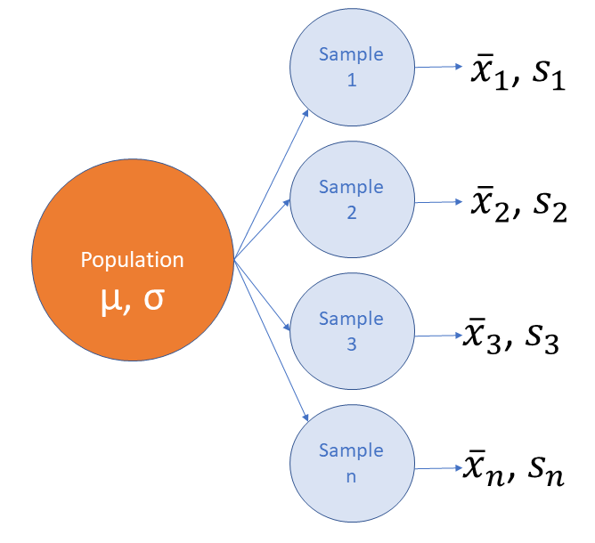

```{r setup, include=FALSE}
rm(list = ls())

knitr::opts_chunk$set(echo = FALSE, message = FALSE)

library(tidyverse)
library(jmv)
library(knitr)
library(kableExtra)
library(openintro)
library(Hmisc)
library(rio)

data(COL)
```
{width=40%}   


**Technischer Hinweis: Links in den Übungen öffnen Sie, indem sie darauf rechtsklicken und "Link in neuem Tab/Fenster öffnen" wählen.**  

**Runden** Sie Kennzahlen und z-Werte auf zwei Stellen nach dem Komma, p-Werte auf drei Stellen nach dem Komma.  


```{r, fig.align='center'}
phydata <- readRDS("../data/physio.rds")

phy_w <- phydata %>% 
    filter(Geschlecht == "w")

# jmv::descriptives(
#   formula = Groesse ~ Geschlecht,
#   data = phydata
# )
```
   

# Zuerst etwas Theorie

## Population und Stichprobe

Nehmen wir an, wir hätten heute die Aufgabe, die durchschnittliche Körpergrösse der Studentinnen PHY13-PHY17 zu bestimmen. Die Studentinnen PHY13-PHY17 wären demnach unsere **Population** und die durchschnittliche Körpergrösse das Merkmal, dessen wahrer Wert üblicherweise unbekannt ist. Wir wissen bereits, dass die Körpergrösse normal verteilt ist. Wir suchen also   
    
- den unbekannten Populations-Mittelwert $\mu$ für die Körpergrösse und  
- die unbekannte Standardabweichung $\sigma$ für die Körpergrösse  

**Beachte:** Die unbekannten Populationskennzahlen werden in griechischen Buchstaben angegeben im Gegensatz zu den Stichproben-Kennzahlen, die in lateinischen Buchstaben angegeben werden ($\bar{x}$ für Mittelwert und $s$ für Standardabweichung).  


### Die Verteilung von Stichprobenmittelwerten

Zur Erinnerung hier nochmals die wichtigsten Kennzahlen zur Körpergrösse der Studentinnen:  


```{r, fig.align='center'}
#phydata <- readRDS("../data/physio.rds")

phy_w <- phydata %>% 
    filter(Geschlecht == "w")

desc <- jmv::descriptives(
  data = phy_w,
  vars = Groesse,
  hist = TRUE
)

desc
```
   
Für die folgenden Überlegungen nehmen wir unsere 183 Studentinnen als Population. Weil wir einen Datensatz mit den Körpergrössen von allen diesen Studentinnen haben, kennen wir in unserem Fall den wahren Mittelwert $\mu$ = `r round(mean(phy_w$Groesse), 2)` und die wahre Standardabweichung $\sigma$ = `r round(sd(phy_w$Groesse), 2)`. *Um die theoretischen Grundlagen zu überprüfen, tun wir jetzt aber so, als ob wir das nicht wüssten!*.   

Um unsere Fragestellung zu untersuchen, ziehen wir aus dieser Population mehrere Zufallsstichproben $sample_1$ bis $sample_n$ (Üblicherweise zieht man nur eine einzige Stichprobe, aber wir machen das hier, um die theoretischen Grundlagen zu erläutern). Von jeder dieser Stichproben bestimmen wir den Mittelwert und die Standardabweichung.



Wir dürfen erwarten, dass der Mittelwert von den Stichprobenmittelwerten $\bar{x}_1$ bis $\bar{x}_n$ etwa dem wahren Mittelwert in der Population $\mu$ enspricht:  

$$\mu \approx \frac{\bar{x}_1+\bar{x}_2+...+\bar{x}_n}{n}$$

Vermutlich wird keiner der Stichprobenmittelwerte  $\bar{x}_1$ bis $\bar{x}_n$ exakt den Populationsmittelwert $\mu$ treffen. Wir erhalten also eine Verteilung der Stichprobenmittelwerte um den Populationsmittelwert $\mu$. Die Standardabweichung des Mittelwerts der einzelnen Stichprobenmittelwerte wird als **Standardfehler SE** (engl. standard error) bezeichnet.  

Bevor Sie jetzt weiterfahren, empfehle ich ihnen ein Video: [Bunnies, Dragons and the 'Normal' World: Central Limit Theorem | The New York Times](https://youtu.be/jvoxEYmQHNM) Youtube, 3m38s  


Jetzt führen wir ein Experiment durch: Ihre Aufgabe ist es, die Körpergrösse von Studentinnen der Physiotherapie PHY13 bis PHY17 zu bestimmen. Sie können unmöglich alle 183 Studentinnen messen, da diese an verschiedenen Orten verteilt sind und der Aufwand unverhältnismässig gross ist. Zum Glück haben Sie 30 Kolleg:innen, die jeweils von 10 Studentinnen PHY13-PHY17 die Kontaktdaten haben. Sie bitten diese 30 Kolleg:innen darum, bei den 10 Studentinnen die Körpergrösse zu erfragen. Am Schluss haben Sie somit 30 Stichproben aus ihrer Population im Umfang von 10 Studentinnen. Sie berechnen von jeder Stichprobe den Mittelwert und die Standardabweichung. Das Ergebnis sieht folgendermassen aus:    

```{r}
set.seed(4)
samples <- bind_rows(replicate(30, phy_w %>% sample_n(10), simplify=F), .id="Sample")

samples_means <- samples %>% 
    group_by(Sample) %>% 
    summarise(
        n = n(),
        m = mean(Groesse),
        s = sd(Groesse)
    ) %>% 
    ungroup() %>% 
    arrange(as.numeric(Sample))
kable(samples_means[1:30,], digits = 2, caption = "Tab. 2: Groesse PHY13-PHY17, 30 Stichproben, n = 10") %>% 
  kable_minimal(full_width = FALSE)
```

**Beachte:** In jeder Stichprobe liegt der Mittelwert in der Nähe des Populationsmittelwertes $\mu = 166.92$ und die Standardabweichung in der Nähe der Populationsstandardabweichung $\sigma = 5.66$.   

Betrachten wir jetzt die Verteilung der Stichprobenmittelwerte im Histogramm:  


```{r, fig.align='center', fig.dim=c(6, 5)}
mean_samples <- paste("M =", round(mean(samples_means$m), 2))
sd_samples <- paste("s = ", round(sd(samples_means$s), 2))

samples_means %>% 
  ggplot(., aes(x = m)) + 
  #geom_dotplot(method = "dotdensity") +
  geom_histogram(bins = 6, fill = "skyblue", color = "white") +
  # stat_function(fun = dnorm,
  #               args = list(mean = mean(samples_means$m),
  #                           sd = sd(samples_means$s)),
  #               color = "darkblue", size = 1, xlim = c(162, 172)) +
  geom_vline(xintercept = mean(phy_w$Groesse), linewidth = 1, color = "purple") +
  geom_vline(xintercept = mean(samples_means$m), linewidth = 1, color ="red", linetype = "dotted") +
  ggtitle("Verteilung der Stichprobenmittelwerte", 
          subtitle = "30 samples, n = 10, violette Linie = Populationsmittelwert") +
  xlab("Stichprobenmittelwerte") +
  annotate("text", x = 164, y = c(10, 9.5), label = c(mean_samples, sd_samples), size = 5, color = "red") +
  theme_classic()
```

Wir sehen, dass sich die Stichprobenmittelwerte wie erwartet um den wahren Populationsmittelwert herum verteilen. Die Verteilung von Stichprobenkennzahlen, hier von Stichprobenmittelwerten, erfolgt annähernd einer Normalverteilung.  

**Zusammenfassung** (Zentraler Grenzwertsatz, central limit theorem, CLT) 

Die Verteilung einer Stichprobenkennzahl (hier der Mittelwerte aller Stichproben $\bar{x}_1$ bis $\bar{x}_n$ folgt annähernd einer Normalverteilung mit einem Mittelwert um den Populationsmittelwert $\mu$ und einer Standardabweichung SE, die gleich der Populationsstandardabweichung $\sigma$ dividiert durch die Quadratwurzel der Stichprobenumfänge n ist. Als Formel ausgedrückt:   

$$\bar{x} \sim N(\bar{x} = \mu, SE = \frac{\sigma}{\sqrt{n}})$$

Wenn die Standardabweichung der Population unbekannt ist, was meist der Fall ist, setzen wir für die Berechnung des Standardfehlers $SE$ anstelle von $\sigma$ die Standardabweichung der Stichprobe $s$ ein:   

$$SE = \frac{s}{\sqrt{n}})$$


<br>

# Verteilung von Stichprobenkennzahlen, Standardfehler  

## Übung 1 {.tabset}

Wir arbeiten mit einer Simulations-App. Rufen Sie den Link [Central Limit Theorem for Means](https://gallery.shinyapps.io/CLT_mean/) auf (Rechtsklick auf den Link > "Link in neuem Tab öffnen").   

### Aufgabe   

1. Wählen Sie *Parent Distribution*: normal (d.h. die Stichproben werden aus einer normalverteilten Population gezogen)        
2. Stellen Sie die Populationskennzahlen *Mean = 0* und *Standard Deviation = 20* ein. Im Fenster rechts unter *Population Distribution* wird jetzt die Verteilung ihrer Population dargestellt. Da die Daten mit ihren Angaben zu Mittelwert und Standardabweichung randomisiert erstellt wurden, kann es sein, dass der Mittelwert und die Standardabweichung leicht von ihren Vorgaben abweichen.     
3. Stellen Sie die Stichprobenangaben *Sample size = 25* und *Number of Samples = 100* ein.
4. Wechseln sie jetzt ins Register *Samples*: Die App hat nach ihren Vorgaben 100 Zufallsstichproben gezogen und die Ergebnisse der ersten acht Stichproben werden angezeigt. Notieren Sie die jeweiligen Mittelwerte *x_bar* und die Standardabweichung *SD* der acht Stichproben.  

Vergrössern Sie jetzt die *Sample Size* auf 100. Hat der Stichprobenumfang einen Einfluss ...    

* (a) ... auf die Standardabweichungen SD der Stichproben (Register *Samples*: Sample 1 bis Sample 8)?  
* (b) ... auf die Mittelwerte $\bar{x}$ der Stichproben (Register *Samples*: Sample 1 bis Sample 8)?
* (c) ... auf den den Standardfehler SE der Verteilung der Stichprobenmittelwerte (Register *Sampling distribution*)?   

Wiederholen Sie die Übung mit Stichprobenumfängen von 200 und 400.   
  
  
### Lösung

* (a) Die Standardabweichungen der Stichproben ensprechen etwa der Standardabweichung der Population $s \approx 20$. Der Stichprobenumfang beeinflusst die Standardabweichung SD der Stichprobe insofern, als dass die Abweichungen der einzelnen Stichproben-Standardabweichungen von der Populationsstandardabweichung $\sigma = 20$ mit steigendem Stichprobenumfang abnehmen.  
* (b) Die Mittelwerte der Stichproben entsprechen etwa dem Mittelwert der Population $\bar{x} \approx 0$. Der Stichprobenumfang beeinflusst die Mittelwerte $\bar{x}$ der Stichproben insofern, als dass die Abweichungen der einzelnen  Stichprobenmittelwerte vom Populationsmittelwert $\mu = 0$ mit steigendem Stichprobenumfang abnehmen.   
* (c) Die Beobachtung aus (b) äussert sich darin, dass mit steigendem Stichprobenumfang die Variation der Stichprobenmittelwerte um den Populationsparameter, ausgedrückt als Standardfehler SE, immer kleiner wird. Eine Vervierfachung des Stichprobenumfangs von 25 auf 100 oder von 100 auf 400 führt zu einer Halbierung des Standardfehlers.

<br>

## Übung 2 {.tabset}

Wir arbeiten weiter mit der Simulations-App [Central Limit Theorem for Means](https://gallery.shinyapps.io/CLT_mean/).

### Aufgabe   

1. Wählen Sie *Parent Distribution*: right skewed (d.h. die Stichproben werden aus einer rechtsschief  verteilten Population gezogen)        
3. Stellen Sie die Stichprobenangaben *Sample size = 2* und *Number of Samples = 700* ein. Notieren Sie sich den Populationsmittelwert *mean of x* und die Standardabweichung *SD of x*, die im Register *Population Distribution* angezeigt wird  

Vergrössern Sie jetzt die *Sample Size* schrittweise. Hat der Stichprobenumfang einen Einfluss ...    

* (a) ... auf die Standardabweichungen SD der Stichproben (Register *Samples*: Sample 1 bis Sample 8)?  
* (b) ... auf die Mittelwerte $\bar{x}$ der Stichproben (Register *Samples*: Sample 1 bis Sample 8)?
* (c) ... auf den den Standardfehler SE der Verteilung der Stichprobenmittelwerte (Register *Sampling distribution*)?  
* (d) ... auf die Form der Verteilung der Stichprobenmittelwerte (Register *Sampling distribution*)?  
  
  
### Lösung

* (a) Die Standardabweichungen der Stichproben ensprechen etwa der Standardabweichung der Population $s \approx \mu$. Der Stichprobenumfang beeinflusst die Standardabweichung SD der Stichprobe insofern, als dass die Abweichungen der einzelnen Stichproben-Standardabweichungen von der Populationsstandardabweichung mit steigendem Stichprobenumfang abnehmen.  
* (b) Die Mittelwerte der Stichproben entsprechen etwa dem Mittelwert der Population $\bar{x} \approx \mu$. Der Stichprobenumfang beeinflusst die Mittelwerte $\bar{x}$ der Stichproben insofern, als dass die Abweichungen der einzelnen  Stichprobenmittelwerte vom Populationsmittelwert mit steigendem Stichprobenumfang abnehmen.   
* (c) Die Beobachtung aus (b) äussert sich darin, dass mit steigendem Stichprobenumfang die Variation der Stichprobenmittelwerte um den Populationsparameter, ausgedrückt als Standardfehler SE, immer kleiner wird. 
* (d) In kleinen Stichproben (n < 30) entspricht die Verteilung der Stichprobenmittelwerte eher der rechtsschiefen Verteilung der Populationsdaten. Mit zunehmendem Stichprobenumfang nähert sich die Verteilung der Stichprobenmittelwerte der Normalverteilung an.  

**Merke:** Unabhängig davon, wie die Daten in der Population verteilt sind (normal, rechtsschief, linksschief, irregulär), nähert sich mit steigendem Umfang die Verteilung der Stichprobenkennzahlen der Normalverteilung an.  

<br>

## Übung 3 {.tabset}

### Aufgabe

Wir wollen untersuchen, ob es einen Unterschied gibt in der körperlichen Aktivität zwischen Männern und Frauen. Eine Zufallstichprobe ergibt, dass Männer an $\bar{x}_{maenner} = 4.3$ und Frauen an $\bar{x}_{frauen} = 3.2$ Tagen pro Woche körperlich aktiv sind. Was wäre eine gute Punktschätzung für die Differenz der körperlichen Aktivität zwischen Männern und Frauen?  

<br/>

### Lösung

Wir können die Differenz der beiden Stichprobenkennzahlen verwenden: $4.3 - 3.2 = 1.1$. Männer sind im Durchschnitt 1.1 Tage/Woche häufiger körperlich aktiv als Frauen.   

<br/>

## Übung 4 {.tabset}

### Aufgabe  

* (a) Würden Sie eher eine grosse oder eher eine kleine Stichprobe wählen, um einen Populationsparameter zu schätzen? Begründen Sie ihre Antwort.    
* (b) Würden Sie erwarten, dass eine Punktschätzung von einer kleinen Stichprobe eher einen kleineren oder eher einen grösseren Standardfehler aufweist als eine Punktschätzung von einer grösseren Stichprobe? Begründn Sie ihre Antwort.  

<br/>

### Lösung

* (a) Nehmen wir als Beispiel zwei Stichproben: Stichprobe 1 umfasst 10 und Stichprobe 2 1000 Beobachtungseinheiten. Einzelne Beobachtungen in Stichprobe 1 haben einen weitaus grösseren Einfluss auf die Punktschätzung, während sich bei grösseren Stichproben wie Stichprobe 2 die einzelnen Werte eher gegenseitig ausgleichen. Die grössere Stichprobe 2 wird daher eher eine präzisere Punktschätzung liefern als die kleine Stichprobe 1.  
* (b) Eine präzisere Schätzung bedeutet, dass sie mit einem geringeren Fehler behaftet ist. Wir können intuitiv sagen, dass eine grosse Stichprobe einen geringeren Fehler aufweist.  

<br/>

## Übung 5 {.tabset}  

### Aufgabe  

In einer Stichprobe von n = 100 Studentinnen ist die Standardabweichung für die Körpergrösse $s = 0.1$ Meter. Die Beobachtungseinheiten sind unabhängig voneinander und der Stichprobenumfang ist kleiner als 10% der Population.  

* (a) Wie gross ist der Standardfehler SE des Mittelwerts $\bar{x} = 1.7m$?   
* (b) Wären wir überrascht, wenn jemand sagen würde, dass die durchschnittliche Grösse aller Studentinnen in Wahrheit 1.69 m beträgt?  

<br/>

### Lösung  

* (a) Der Standardfehler berechnet sich aus der Formel $SE = s/\sqrt{n} = 0.1/\sqrt{100} = 0.01$ Meter.   
* (b) Das wäre nicht überraschend. Unsere Stichprobe ist 1 SE von 1.69 entfernt und das bedeutet dass unser Wert nahe am wirklichen Populationsparameter liegt.  

<br>

## Übung 6 {.tabset}  

### Aufgabe   

* (a) Was ist vertrauenswürdiger: Eine Stichprobe A mit n = 100 oder eine Stichprobe B mit n = 400 Beobachtungseinheiten? Begründen Sie ihre Antwort.    
* (b) Zeigen Sie mathematisch, dass unsere Punktschätzung präziser ist, wenn der Stichprobenumfang grösser ist: Berechnen Sie dazu den Standardfehler für die beiden Stichproben A und B; die Standardabweichung beträgt für beide Stichproben $s = 10$.  

<br>

### Lösung  

* (a) Zusätzliche Beobachtungseinheiten sind immer wertvoll, wenn man einen Populationsparameter schätzen muss. Allerdings bedeuten grössere Stichproben in der Realität auch höhere Kosten, weshalb der Stichprobenumfang stets einen Kompromiss zwischen Präzision und Kosten darstellt. 
* (b) Der Standardfehler für n = 100 ist $SE = 10/sqrt{100} = 1$, für n = 400 $SE = 10/\sqrt{400} = 0.5$  

Hinweis: Beachten Sie an diesem Beispiel, dass für eine Halbierung des Standardfehlers, der Stichprobenumfang vervierfacht werden muss (Wurzel-n-Gesetz)

<br>


# Vertrauensintervalle (CI)   

Wenn wir eine Population untersuchen, können wir normalerweise nicht mehrere Stichproben analysieren und müssen uns auf eine einzige Stichprobe verlassen. Aber wie präzise lässt sich der wahre Populationsmittelwert $\mu$  mit einer einzelnen Stichprobe bestimmen?

Nehmen wir als Beispiel die erste Stichprobe von unserem Versuch oben:

```{r}
sample1 <- samples %>% 
    filter(Sample == "1") %>% 
    select(Sample, Kohorte, Groesse)
kable(sample1, caption = "Tab. 3: Stichprobe 1") %>% 
  kable_minimal(full_width = FALSE)
```

```{r}
sample1 %>% 
    summarise(
        m = mean(Groesse),
        s = sd(Groesse)
    ) %>% 
    kable(., digits = 2, caption = "Tab. 4: Mittelwert und Standardabweichung für Stichprobe 1") %>% 
  kable_minimal(full_width = FALSE)
```

```{r, fig.align='center'}
m <- mean(phy_w$Groesse)
# sample %>% 
#     ggplot(., aes(x = Groesse)) +
#     geom_histogram(bins = 6, color = "white", fill = "skyblue") +
#     facet_wrap(~as.numeric(Sample)) +
#     ggtitle("Verteilung der Stichprobendaten 1 bis 30")

sample1 %>% 
  ggplot(., aes(x = Groesse)) +
  geom_histogram(aes(y = ..density..), bins = 4, color = "white", fill = "skyblue") +
  stat_function(fun = dnorm, 
                args = list(mean = mean(sample1$Groesse), 
                            sd = sd(sample1$Groesse)),
                color = "darkblue", linewidth = 1, xlim = c(150, 185)) +
  geom_vline(xintercept = m, linewidth = 1, color = "purple") +
  ggtitle("Verteilung der Stichprobendaten 1", 
          subtitle = "n = 10, violette Linie = Populationsmittelwert") +
  theme_classic()
```

Wie wir aus dem zentralen Grenzwertsatz gelernt haben, ist die Standardabweichung für den Mittelwert der Stichprobenmittelwerte der Standardfehler $SE$. Wir haben im Moment (und auch in der Regel) zwar nur eine einzige Stichprobe, daher müssen wir die Kennzahlen unserer Stichprobe als besten Schätzer verwenden. D.h.   

$$\mu \approx \bar{x}$$

$$SE = \frac{\sigma}{\sqrt{n}} \approx \frac{s}{\sqrt{n}}$$

Wie wir auch aus der Geometrie der Normalverteilung wissen, umfasst der Bereich $\bar{x} \pm 1.96s$ 95% der zu erwartenden Werte. Für die Schätzung der Vorhersagegenauigkeit unseres Mittelwertes kombinieren wir jetzt diese Kenntnisse und berechnen das 95%-Vertrauensintervall ($CI_{95}$) für den Mittelwert.  

$$CI_{95} = \bar{x} \pm 1.96 \times SE$$

$$CI_{95} = 168.1 \pm 1.96 \times \frac{7.61}{\sqrt{10}} = [163.38, 172.82]$$

**Interpretation des 95% CI** Wenn wir 100 Stichproben mit gleichem Stichprobenumfang aus der Population untersuchen, werden 95% der Vertrauensintervalle den wahren Populationsmittelwert $\mu$ enthalten.  

```{r, fig.align='center', eval = FALSE}
m_sample1 <- mean(sample1$Groesse)
se_sample1 <- sd(sample1$Groesse)/sqrt(length(sample1$Groesse))

ci_low <- m_sample1 - 1.96 * se_sample1
ci_up <- m_sample1 + 1.96 * se_sample1

sample1 %>% 
  ggplot(., aes(x = Groesse)) +
  geom_histogram(aes(y = ..density..), bins = 4, color = "white", fill = "skyblue", alpha = .5) +
  stat_function(fun = dnorm, 
                args = list(mean = mean(sample1$Groesse), 
                            sd = sd(sample1$Groesse)),
                color = "red", linewidth = 1, xlim = c(150, 185)) +
  geom_vline(xintercept = m, linewidth = 1, color = "purple") +
  geom_area(stat = "function", fun = dnorm, 
            args = list(mean = mean(sample1$Groesse), sd = sd(sample1$Groesse)), 
            fill = "chartreuse1", alpha = .5, xlim = c(ci_low, ci_up)) +
  ggtitle("Verteilung der Stichprobendaten 1", 
          subtitle = "n = 10, violette Linie = Populationsmittelwert,\ngrüne Fläche = 95% CI für den Stichprobenmittelwert")
```

Nach diesen Erläuterungen müsste das 95%-Konfidenzintervall in 95% von unseren 30 Stichproben den Populationsmittelwert enthalten (95% von 30 = 28.5).

```{r, fig.align='center', fig.width=8}
mu <- mean(phy_w$Groesse)
samples %>% 
  ggplot(., aes(x = as.numeric(Sample), y = Groesse)) +
   geom_hline(yintercept = mu, color = "red", linewidth = 1) +
  stat_summary(geom="errorbar", fun.data=mean_cl_normal, width=0.1) +
  stat_summary(geom="point", fun = mean) +
  ggtitle("Grösse der Studentinnen PHY13-PHY17, 30 samples, n = 10",
          subtitle = "95%-Vertrauensintervalle, rote Linie = Populationsmittelwert (166.94 cm)") +
  ylab("Grösse in cm") +
  xlab("Stichproben") +
  theme_classic()
```

Von den 30 Stichproben enthalten 27 den Populationsmittelwert und 3 Stichproben (Sample 4, 14 und 17), also 10%, enthalten ihn nicht. Diese Abweichung von den erwarteten 5% ist auf zufällige Variation zurückzuführen. Je mehr Stichproben wir nehmen würden, desto mehr würden wir uns dem theoretischen Modell annähern.

**Quintessenz:** Wir wissen zwar nicht, ob ein 95%-Konfidenzintervall den wahren Populationsparameter enthält, aber wir können zu 95% darauf vertrauen, dass ein bestimmtes 95%-Konfidenzintervall den wahren Parameter enthält. 

<br>

## Übung 7 {.tabset}

### Aufgabe  

Wenn wir sicher sein wollen, dass unser Vertrauensintervall den Populationsparameter beinhaltet, sollten wir dann eher ein breites (z.B. 95%-CI) oder eher ein schmales Vertrauensintervall (60%-CI) verwenden?  

<br>

### Lösung

Wenn wir sicher sein wollen, einen Fisch zu fangen, müssen wir ein grösseres Netz wählen. Genau gleich verhält es sich mit Vertrauensintervallen: Wenn wir ein grösseres Vertrauensintervall wählen, können wir eher darauf vertrauen, dass es den  Populationsparameter beinhaltet.  

<br>

## Übung 8  {.tabset}

Verwenden Sie für diese Aufgaben die Angaben aus Tabelle 2 oben.

### Aufgaben

1. Welche untere und obere Grenze hat das 95%-Vertrauensintervall der 3. Stichprobe? (m = 166.2, s = 5.31, n = 10)
2. Welche untere und obere Grenze hat das 95%-Vertrauensintervall der 4. Stichprobe? (m = 162.8, s = 4.87, n = 10)
3. Inwiefern unterscheiden sich die 95%-Vertrauensintervalle der 2. und der 4. Stichprobe bezüglich der Schätzung des Populationsmittelwerts $\mu = 166.92$?
<br />


### Lösungen

$\bar{x} = 166.2, s = 5.31, n = 10$
  
   Für die Berechnung des Vertrauensintervalls benötigen Sie den Standardfehler SE:
  
$$SE = \frac{s}{\sqrt{n}} = \frac{5.31}{\sqrt{10}} = \frac{5.31}{3.16} = 1.679$$
  
   Die Formel für die Berechnung des 95%-Vertrauensintervalls lautet
  
$$CI_{95} = \bar{x} \pm 1.96 SE = 166.2 \pm 1.96 \times 1.679 = [162.91, 169.50]$$

2. Vorgehen wie Aufgabe 1: [159.78, 165.82]    
3. Der Populationsmittelwert beträgt 166.92 cm. Das 95%-Vertrauensintervall der Stichprobe 2 enthält den wahren Populationsmittelwert, während das Intervall der 4. Stichprobe den wahren Mittelwert nicht enthält.   

<br />
<br />

## Übung 9 {.tabset}

### Aufgabe

Wie oft wird das 95%-Vertrauensintervall erwartungsgemäss den wahren Populationsmittelwert verfehlen, wenn Sie a) 20, b) 60, c) 120 Stichproben mit dem gleichen Stichprobenumfang untersuchen.

<br />
<br />

### Lösung

a) $0.05 \times 20 = 1$, b) $0.05 \times 60 = 3$, c) $0.05 \times 120 = 6$
<br />
<br />

## Übung 10 {.tabset}

### Aufgabe

Wie können Sie die Präzision ihrer Schätzung des wahren Populationsmittelwerts durch eine Anpassung des Untersuchungsdesigns erhöhen?
<br />
<br />

### Lösung

Durch die Erhöhung des Stichprobenumfangs  $n$. Da der Standardfehler $SE$ u.a. vom Stichprobenumfang abhängig ist, verkleinert sich das 95%-Vertrauensintervall proportional zur $\sqrt{n}$. Eine schöne Animation zu dieser Frage liefert  https://seeing-theory.brown.edu/frequentist-inference/index.html#section2 . Verändern Sie in den Einstellungen den Stichprobenumfang $n$ und beachten Sie, wie sich die Breite der Konfidenzintervalle verändert.

<br />
<br />


# Referenzen  

[Stats and R: Hypothesis test by hand](https://statsandr.com/blog/hypothesis-test-by-hand/)    
[Central limit theorem for Means](https://gallery.shinyapps.io/CLT_mean/)    
[Seeing Theory: Confidence Intervall](https://seeing-theory.brown.edu/frequentist-inference/index.html#section2)  
<br />

