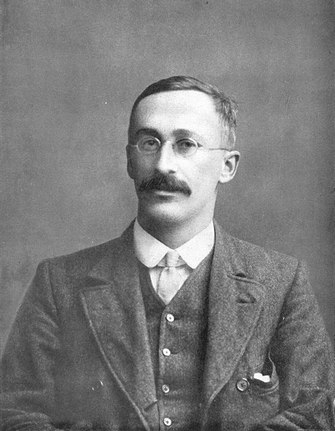

```{r setup, include=FALSE}
rm(list = ls())

knitr::opts_chunk$set(echo = FALSE, message = FALSE, fig.align = "center")

library(tidyverse)
library(jmv)
library(knitr)
```
{width=40%}   


# Exkurs: Die t-Verteilung    



[William S. Gosset, Pseudonym: Student](https://de.wikipedia.org/wiki/William_Sealy_Gosset) hatte festgestellt, dass die standardisierte Schätzfunktion des Stichproben-Mittelwerts normalverteilter Daten nicht mehr normalverteilt, sondern t-verteilt ist, wenn die zur Standardisierung des Mittelwerts benötigte Varianz des Merkmals unbekannt ist und mit der Stichprobenvarianz geschätzt werden muss. Seine t-Verteilung erlaubt – insbesondere für kleine Stichprobenumfänge – die Berechnung der Verteilung der Differenz vom Mittelwert der Stichprobe zum wahren Mittelwert der Grundgesamtheit.

Die t-Werte hängen vom Signifikanzniveau sowie von der Stichprobengrösse $n$ ab und bestimmen das Vertrauensintervall und damit die Aussagekraft der Schätzung des Mittelwertes. Die t-Verteilung wird mit wachsendem Stichprobenumfang schmaler und geht für grosse Stichprobenumfänge in die Normalverteilung über (siehe Grafik unten). Hypothesentests, bei denen die t-Verteilung Verwendung findet, bezeichnet man als *t-Tests* bzw. *Student's t-Test*. [mod. nach Wikipedia](https://de.wikipedia.org/wiki/Studentsche_t-Verteilung)    

Hier ein kurzes Video zur Frage, was William S. Gosset, Bierbrauen und Statistik miteinander verbindet [The Brewer Who Secretly Revolutionized Statistics](https://youtu.be/Ea4_eX--mIY), Youtube, EN, 5m46s  

## Merke  

* Für die praktische Arbeit gilt, dass die $t$-Verteilung als Anpassung der Normalverteilung für kleine Stichprobenumfänge aufgefasst werden kann. Ab einem Stichprobenumfang von n > 30 (dieser Grenzwert ist unter Fachleuten umstritten, aber wir arbeiten damit) entspricht sie annähernd der Normalverteilung. Der $t$-Wert, den Statistikprogramme berechnen, kann analog zu den $z$-Werten interpretiert werden.    
* Die Form der $t$-Verteilung ist abhängig vom Stichprobenumfang $n$. Dieser wird in Freiheitsgraden (degrees of freedom, $df$ angegeben), wobei $df = n - 1$. 

```{r}
par(bg = "lightgrey")
curve(dt(x, 15), from = -5, to = 5, col = "firebrick", 
      xlab = "", ylab = "", lwd = 2, main = "t-Distribution", axes = FALSE)
curve(dt(x, 8), from = -5, to = 5, col = "red", add = TRUE, lwd = 2)
curve(dt(x, 5), from = -5, to = 5, col = "firebrick2", add = TRUE, lwd = 2)
curve(dt(x, 3), from = -5, to = 5, col = "orange2", add = TRUE, lwd = 2)
curve(dt(x, 2), from = -5, to = 5, col = "orange", add = TRUE, lwd = 2)
curve(dt(x, 1), from = -5, to = 5, col = "yellow", add = TRUE, lwd = 2)
curve(dnorm(x), from = -5, to = 5, col = "purple", add = TRUE, lwd = 2)
legend("topleft", legend = paste0("df = ", c(1, 2, 3, 5, 8, 15, "norm")),
       col = c("yellow", "orange", "orange2", "firebrick2", "red", "firebrick", "purple"),
       lty = 1, lwd = 2)
```

## Praxis: Hypothesentests für quantitative Daten

Vorgehen   

1. Hypothesen $H_0$ und $H_A$ formulieren. Sind diese einseitig oder zweiseitig formuliert?  
2. Signifikanzniveau festlegen. I.d.R. $\alpha < .05$
3. Sind die Daten gepaart (paired) oder unabhängig (independent)? 
4. Prüfgrösse bestimmen: 
   + für unabhängige Daten: $\mu_2 - \mu_1$ (Differenz der Mittelwerte)   
   + für gepaarte Daten: $\mu_{diff}$ (Mittelwert der paarweisen Differenzen) 
   + wenn Sie sich für nicht-parametrische Tests entscheiden, ersetzen sie $\mu$ durch $Md$ bzw $\tilde{x}$ (Median)
5. Stichprobenumfang prüfen   
   + $n < 30$: nichparametrischen Test (Wilcoxon) wählen.    
   + unterschiedliche Stichprobenumfänge bei unabhängigen Daten: nichtparametrischen Test (Wilcoxon) wählen.   
6. Verteilung der Prüfgrösse untersuchen    
   + Daten sind annähernd normalverteilt: $t$-Test wählen    
   + Daten sind nicht normalverteilt: nichtparametrischen Test (Wilcoxon) wählen     
   + Unterschiedliche Varianzen bei unabhängigen Daten: nichtparametrischen Test (Wilcoxon) wählen.    
7. Vertrauensintervalle für die Prüfgrösse berechnen (**jamovi** > Register *Analyses* > *T-Tests* > *Additional Statistics: Mean Difference*)
8. Gewählten Test durchführen: $t$- und $p$-Wert bestimmen (**jamovi** >> T-Tests)    
9. Schlussfolgerung ziehen und das Ergebnis im Zusammenhang mit der Forschungsfrage interpretieren.    

## Hinweis zu jamovi    

* Der *Wilcoxon Rangsummen-Test* für unabhängige Daten heisst hier *Man-Whitney-U*.   
* Der *Wilcoson Vorzeichenrang-Test* für gepaarte Daten heist in jamovi *Wilcoxon Rank*.


# Übung 1 {.tabset}

## Aufgabe

*Diese Übung machen wir von Hand, um das Prinzip zu verstehen.*

Eine Kaffeekette betreibt eine Filiale in Basel und eine Filiale in Bern. Die Berner Kolleginnen erzählen, dass sie mehr Caffè Latte (mittlere Grösse) in Bern als in Basel für das gleiche Geld erhalten. Sie können das nicht glauben und wollen der Sache auf den Grund gehen. Ihre Frage ist: Unterscheiden sich die Kaffeemengen an den Standorten Basel und Bern?    

Als erstes sammeln Sie Daten: Sie kaufen an beiden Standorten 20 Becher Caffè Latte mittlerer Grösse. Sie messen jeweils die Mengen in ml. Ihre Auswertung kommt zu folgendem Ergebnis:

| Ort | n | m | s |
|:---:|:-:|:-:|:-:|
Bern | 20 | 311.7 | 22.8  
Basel | 20 | 301.9 | 8.4    
<br />

1. Formulieren Sie ihre Hypothese.      
2. Berechnen sie die Vertrauensintervalle für die Kaffeemengen von Bern und Basel    
3. Berechnen sie den t-Wert für den Mittelwertsvergleich.  
4. Formulieren Sie ihr Resultat in ein bis zwei Sätzen. 
<br />

**Hinweise:**   

* Wir legen das Signifikanzniveau auf $\alpha = .05$ fest.

* Das Vorgehen ist vergleichbar mit den Übungen zu den Einstichproben-Tests. Allerdings haben Sie jetzt zwei Mittelwerte und zwei Standardabweichungen. Für die Berechnung von $SE$ müssen sie deshalb aus diesen beiden Standardabweichungen den gemeinsamen Standardfehler $SE_{pooled}$ berechnen nach der (etwas vereinfachten) Formel:


$$SE_{pooled} = \sqrt{\frac{s_{Bern}^2}{n_{Bern}} + \frac{s_{Basel}^2}{n_{Basel}}}$$


* Die Berechnung des t-Werts erfolgt nach der Formel    

$$t = \frac{\bar{x}_{Bern} - \bar{x}_{Basel}}{SE_{pooled}}$$

* Die Anzahl Freiheitsgrade $df$ ist  

$$df = n_1 + n_2 - 2 = n_{Bern} + n_{Basel} - 2$$

<br />

## Lösung

1. Formulieren Sie ihre Hypothese.     

* $H_0$ : Die Kaffeemengen von Bern und Basel unterscheiden sich nicht. $\mu_{Basel} = \mu_{Bern}$.    
* $H_A$ : Die Kaffeemengen von Bern und Basel unterscheiden sich. $\mu_{Basel} \neq \mu_{Bern}$.  

2. Berechnen sie die Vertrauensintervalle für die Kaffeemengen von Bern und Basel.    

* *Wenn Sie die Vertrauensintervalle nicht von Hand rechnen wollen, können Sie diesen Code kopieren und in jamovi: Rj-Editor eingeben.*    

```{r, echo = TRUE}
## Code für Rj-Editor

# Kennzahlen in Variablen erfassen
n <- 20            # beide Stichprobenumfänge betragen n = 20
m_Bern <- 311.7    # durchschnittliche Kaffeemenge in Bern
s_Bern <- 22.8     # Standardabweichung in Bern
m_Basel <- 301.9   # durchschnittliche Kaffeemenge in Basel
s_Basel <- 8.4     # Standardabweichung in Basel

# 95%-CI für Bern berechnen
se_Bern <- s_Bern/sqrt(n)               # SE für Bern
ci_Bern <- m_Bern + c(-2, 2) * se_Bern  # Grenzen für 95%-CI
ci_Bern <- round(ci_Bern, 2)            # 95%-CI auf zwei Stellen runden

# CI für Basel
se_Basel <- s_Basel/sqrt(n)                # SE für Basel
ci_Basel <- m_Basel + c(-2, 2) * se_Basel  # Grenzen für 95%-CI Basel
ci_Basel <- round(ci_Basel, 2)             # 95%-CI auf zwei Stellen runden

# 95%-CIs anzeigen
ci_Basel
ci_Bern
```

* In Bern beinhaltet ein Becher Kaffee im Durchschnitt 311.7 [301.5, 321.9] ml, in Basel im Durchschnitt 301.9 [298.1, 305.7] ml. Mit Blick auf die Mittelwerte scheint die Aussage ihrer Berner Kollegin zu stimmen. Wenn wir allerdings die Vertrauensintervalle betrachten, sehen wir, dass sich diese überschneiden. Daher besteht keine Evidenz dafür, dass die Kaffeemengen in Bern und Basel unterschiedlich sind und wir können die $H_0$ nicht verwerfen.  

<br />

3. Berechnen sie den t-Wert für den Mittelwertsvergleich.  

```{r, echo=TRUE}
# gemeinsamen Standardfehler berechnen (vereinfacht)
se_pooled <- sqrt((s_Bern^2/n) + (s_Basel^2/n))
se_pooled  # se_pooled anzeigen

# t-Wert berechnen
t_Wert <- (m_Basel - m_Bern)/se_pooled
t_Wert     # t_Wert anzeigen
```

* Der t-Wert für die Differenz der Kaffeemengen beträgt -1.804. Damit ist der Wert kleiner als +2/-2 Standardfehler und liegt im Nicht-Verwerfungsbereich für die $H_0$.   

```{r}
cord.x <- c(-2, seq(-2, 2, 0.01),2) 
cord.y <- c(0, dt(seq(-2, 2, 0.01), df = 28),0) 
curve(dt(x, df = 38),xlim=c(-4, 4),main='t-Distribution, df = 38, area = 95% (t = 2.0)', col = "black", xlab = "", ylab = "")
polygon(cord.x,cord.y,col='lightblue', border = "black")
points(x = -1.8, y = 0, pch = 21, bg = "orange", col = "red", cex = 2)
```


```{r, echo=TRUE}
# p-Wert für 2-seitige Hypothese berechnen
p_value <- 2 * pt(t_Wert, df = 38)
p_value
```

* Der p-Wert ist mit 0.079 > 0.05. Wir haben keine Evidenz dafür, dass sich die Kaffeemengen in Bern und Basel signifikant unterscheiden und verwerfen $H_0$ nicht.   

<br />

4. Formulieren Sie ihr Resultat in ein bis zwei Sätzen. 

* *Die durchschnittliche Kaffeemenge in der Filiale in Bern (311.7 [301.5, 321.9] ml) und in der Filiale in Basel (301.9 [298.1, 305.7] ml) unterscheiden sich nicht, t = -1.804, df = 38, p = 0.079.*   

<br />


# Übung 2 {.tabset}

Laden Sie die Datei `caffe.csv` in **jamovi**. **jamovi** erkennt die Datentypen automatisch korrekt.    

Codebook: Der Datensatz umfasst zwei Variablen     

Variable | Beschreibung
-------- | ------------
Ort | Ort der Datenerhebung: Bern, Basel    
Menge | Kaffeemenge in ml  


## Aufgabe  

0. Laden Sie den Datensatz in jamovi.   
1. Formulieren Sie ihre Hypothese.   
2. Beschreiben Sie die Daten deskriptiv. Erstellen Sie ein Boxplot für den Vergleich der Kaffeemengen in Bern und Basel.   
3. Wählen Sie den richtigen t-Test aus (gemäss der Entscheidungskriterien müssten wir hier einen Man-Whitney-U-Test wählen, da n < 30, wir wählen aber den t-Test um das Ergebnis mit der Übung 1 zu vergleichen). Erstellen Sie auch eine Grafik für den Vergleich der 95%-Vertrauensintervalle.    
4. Kopieren Sie den jamovi-Output in ein Word-Dokument und beschriften Sie die Tabellen und Grafiken so, dass sie selbsterklärend sind. Formulieren Sie ihr Resultat in ein bis zwei Sätzen.  
<br />
<br />

## Lösung  

1. Formulieren Sie ihre Hypothese.   

* $H_0$ : Die Kaffeemengen von Bern und Basel unterscheiden sich nicht. $\mu_{Basel} = \mu_{Bern}$.    
* $H_A$ : Die Kaffeemengen von Bern und Basel unterscheiden sich. $\mu_{Basel} \neq \mu_{Bern}$.   

2. Beschreiben Sie die Daten deskriptiv und erstellen Sie ein Boxplot für den Vergleich der Kaffeemengen in Bern und Basel.   

```{r, results='asis'}
caffe <- read_csv("../data/caffe.csv")

desc_caffe <- jmv::descriptives(
  formula = Menge ~ Ort,
  data = caffe,
  se = TRUE,
  box = TRUE
)

cat("<pre>")
print(desc_caffe)
cat("</pre>")
```

* Der korrekt beschriftete Plot könnte etwa so aussehen:   

```{r}
ggplot(caffe, aes(y = Menge, x = Ort)) +
  geom_boxplot() +
  ggtitle("Menge Caffe latte mittlerer Grösse in Bern und Basel (n = 20 pro Ort)") +
  xlab("") +
  ylab("Menge (ml)") +
  theme_classic()
```

<br />

3. Wählen Sie den richtigen $t$-Test aus. Erstellen Sie auch eine Grafik für den Vergleich der 95%-Vertrauensintervalle.  

* Es handelt sich um unabhängige Daten, daher wählen wir den *independent samples t-test*.  
* Wählen sie den *Student's Test* und unter *Additional Statistics > Descriptive plots*.    
* Gegenüber der Berechnung von Hand ergeben sich geringfügige Rundungsfehler.    

```{r, results='asis'}
caffe_tt <- jmv::ttestIS(
  formula = Menge ~ Ort,
  data = caffe,
  vars = Menge,
  plots = TRUE
)

cat("<pre>")
print(caffe_tt)
cat("</pre>")
```

<br />

4. Formulieren Sie ihr Resultat in ein bis zwei Sätzen.   

* *Die durchschnittliche Kaffeemenge in Bern (311.7 [301.5, 321.9] ml) und in Basel (301.9 [298.1, 305.7] ml) unterscheiden sich nicht signifikant, t = -1.798, df = 38, p = 0.080.*  

<br />
<br />


# Übung 3 {.tabset}

Arbeiten Sie mit dem Datensatz `physio.csv` bzw. `physio.omv`, den Sie bereits früher erstellt haben.   

<br />

## Aufgabe

Untersuchen Sie, ob sich Studentinnen und Studenten in ihrer Körpergrösse unterscheiden.  

0. Laden Sie den Datensatz `physio.omv` in jamovi.   
1. Formulieren Sie ihre Hypothesen.   
2. Beschreiben Sie die Daten deskriptiv. Erstellen Sie ein Boxplot für den Vergleich der Körpergrössen von Studentinnen und Studenten.   
3. Prüfen Sie die Testvoraussetzungen und wählen Sie einen statistischen Test. Erstellen Sie auch eine Grafik für den Vergleich der 95%-Vertrauensintervalle.   
4. Kopieren Sie den jamovi-Output in ein Word-Dokument und beschriften Sie die Tabellen und Grafiken so, dass sie selbsterklärend sind. Formulieren Sie ihr Resultat.    
<br />


## Lösung

1. Formulieren Sie ihre Hypothese.   

* $H_0$ : Die Körpergrössen von Studentinnen (w) und Studenten (m) unterscheiden sich nicht. $\mu_{w} = \mu_{m}$.    
* $H_A$ : Die Körpergrössen von Studentinnen (w) und Studenten (m) unterscheiden sich. $\mu_{w} \neq \mu_{m}$.  

2. Beschreiben Sie die Daten deskriptiv. Erstellen Sie ein Boxplot für den Vergleich der Körpergrössen von Studentinnen und Studenten.   

```{r, results='asis'}
phydata <- readRDS(file = "../data/physio.rds")

phy_desc <- jmv::descriptives(
  formula = Groesse ~ Geschlecht,
  data = phydata,
  box = TRUE,
  sd = TRUE
)

cat("<pre>")
print(phy_desc)
cat("</pre>")
```
<br />

3. Prüfen Sie die Testvoraussetzungen und wählen Sie einen statistischen Test. Erstellen Sie auch eine Grafik für den Vergleich der 95%-Vertrauensintervalle.   

* Die Daten sind unabhängig.  
* Die Hypothesen sind zweiseitig formuliert.   
* Median und Mittelwert unterscheiden sich in beiden Gruppen kaum, das  spricht für Normalverteilung der Daten.   
* Die Boxplots sind weitgehend symmetrisch (vielleicht leicht rechtssteil), das spricht für Normalverteilung der Daten.    
* Die QQ-Plots sind weitgehend linear, das spricht für Normalverteilung   

```{r, results='asis'}
phy_desc2 <- jmv::descriptives(
  formula = Groesse ~ Geschlecht,
  data = phydata,
  qq = TRUE,
  n = TRUE,
  missing = FALSE,
  mean = FALSE,
  median = FALSE,
  sd = FALSE,
  min = FALSE,
  max = FALSE
)

cat("<pre>")
print(phy_desc2)
cat("</pre>")
```

* Die Stichprobenumfänge in den beiden Gruppen ($n_w$ = 183, $n_m$ = 45) unterscheiden sich stark.   

**Testentscheid:** Auf Grund der grossen Unterschiede in den Stichprobenumfängen entscheiden wir uns für den Wilcoxon-Rangsummen-Test (Man-Whitney-U). Zum Vergleich führen wir aber auch den Zwei-Stichproben-$t$-Test durch.   

```{r, eval = TRUE}
jmv::ttestIS(
  formula = Grösse ~ Geschlecht,
  data = phydata,
  vars = Groesse,
  mann = TRUE,
  meanDiff = TRUE,
  ci = TRUE,
  plots = TRUE
)

#t.test(data = phydata, Groesse ~ Geschlecht)
```

Output lesen und verstehen:  

1. Student's t    

   + Statistic = t-Wert = t = 13.38  
   + df = degrees of freedom = $n_w + n_m - 2$ = 228 - 2 = 226    
   + p = p-Wert < .001    
   + Mean difference = $\mu_m - \mu_w$ =  12.94    
   + SE difference = Standardfehler für die Differenz der Mittelwerte = .9671   
   + Lower = Untere Grenze des 95%-CI für die Differenz der Mittelwerte = 11.04     
   + Upper = Obere Grenze des 95%-CI für die Differenz der Mittelwerte = 14.85  
   
<br>
   
2. Man-Whitney-U    

   + Statistic: Teststatistik U = 486.5 (diesen Wert interpretieren wir nicht!)    
   + p = p-Wert < .001   
   + Mean difference = $Md_m - Md_w$ (Differenz der Mediane)   
   + Lower: Untere Grenze des 95%-CI für die Differenz der Mediane = 13   
   + Upper: Obere Grenze des 95%-CI für die Differenz der Mediane = 15   
   
<br>
   
3. Grafik 95% CI    

   + zeigt die Vertrauensintervalle für $\mu_m$ und $\mu_w$.    
   + Die Vertrauensintervalle überschneiden sich nicht.    
   + Zusatzfrage: Warum ist das Vertrauensintervall für $\mu_w$ schmaler als für $\mu_m$?     
   
* Mit diesen Resulten besteht Evidenz dafür, dass sich Studentinnen und Studenten in der  druchschnittlichen Körpergrösse unterscheiden. Da p < .05 ist, verwerfen Sie $H_0$ zugunsten von $H_A$.     

4. Kopieren Sie den jamovi-Output in ein Word-Dokument und beschriften Sie die Tabellen und Grafiken so, dass sie selbsterklärend sind. Formulieren Sie ihr Resultat.   

* **Merke:** Wir haben uns auf Grund der Entscheidungskriterien für den Wilcoxon-Test entschieden, daher werden in einem Bericht nur diese Ergebnisse präsentiert. Zu Übungszwecken wird unten zusätzlich das Ergebnis für den t-Test formuliert!   

* *für den Wilcoxon-Test: Geprüft wurde die Frage, ob sich Physiotherapie-Studentinnen und -Studenten in ihrer Körpergrösse unterscheiden. In Stichproben aus den Studienjahrgängen PHY13 - PHY17 ($n_w$ = 183, $n_m$ = 45) wurde die Körpergrösse gemessen. Studenten sind im Durchschnitt (Median) um 13 [11, 15] cm grösser als Studentinnen, Man-Whitney-$U$  = 486.5, $p$ < .001.*   

* *für den $t$-Test: Geprüft wurde die Frage, ob sich Physiotherapie-Studentinnen und -Studenten in ihrer Körpergrösse unterscheiden. In Stichproben aus den Studienjahrgängen PHY13 - PHY17 ($n_w$ = 183, $n_m$ = 45) wurde die Körpergrösse gemessen. Studenten sind im Durchschnitt um 12.94 [11.04, 14.85] cm grösser als Studentinnen, $t$ = 13.38, $df$ = 226, $p$ < .001.*  

* Antwort auf die Zusatzfrage unter 3: Je grösser der Stichprobenumfang, desto kleiner wird $SE = \frac{s}{\sqrt{n}}$, desto schmaler das 95%-Konfidenzintervall. `r emo::ji("flexed biceps")`

<br />
<br />

# Übung 4 {.tabset}

Ein Gefängnisaufenthalt ist mit psychischem Stress verbunden. Eine Möglichkeit, diesen Stress abzubauen ist sportliche Betätigung. Ein Studie hat den Stresslevel von 26 Gefängnissinsassen bei Ein- und Austritt mittels Fragebogen untersucht. Ein Teil der Gefangenen erhielt ein sportliches Training.   

Laden Sie die Datei `prisonStress.csv` in **jamovi**.    

Codebook: Der Datensatz umfasst 5 Variablen    

Variable | Beschreibung | jamovi-Skalenniveau |
:------- |:------------ |:------------ |
Subject | anonyme ID | nominal-text |
Group | Gruppe sport oder control | nominal-text |
PSSbefore | Stresslevel (Assessment-Score) bei Eintritt |continuous-integer |
PSSafter | Stresslevel (Assessment-Score) bei Austritt |continuous-integer |
Diff | Paarweise Differenzen (PSSafter - PSSbefore) | continuous-integer |

## Aufgabe

```{r}
prison <- read_csv("../data/prisonStress.csv")
prison$Group <- factor(prison$Group)
```


0. Laden Sie den Datensatz in **jamovi** und kategorisieren Sie die Variablen.    
1. Frage: Haben beide Gruppen bei Eintritt den gleichen Stresslevel?    
2. Frage: Haben beide Gruppen bei Austritt den gleichen Stresslevel?        
3. Frage: Besteht ein Unterschied im Stresslevel zwischen Ein- und Austritt in der Kontrollgruppe?      
4. Frage: Besteht ein Unterschied im Stresslevel zwischen Ein- und Austritt in der Sportgruppe?    
5. Frage: Hat Sport einen Effekt auf den Stresslevel im Vergleich zu einer Kontrollgruppe, die keinen Sport macht?  

Führen Sie für alle Fragen eine vollständige statistische Analyse durch.

## Lösung 1

Fragestellung: Haben beide Gruppen bei Eintritt den gleichen Stresslevel?  

1. Hypothesen    

   + $H_0$ Es besteht kein Unterschied im Stresslevel der Gruppen Sport und Kontrolle bei Eintritt, $\mu_{con,before} = \mu_{sport,before}$  
   + $H_A$ Es besteht ein Unterschied im Stresslevel der Gruppen Sport und Kontrolle bei Eintritt, $\mu_{con,before} \neq \mu_{sport,before}$    
2. Das Signifikanzniveau legen wir bei $\alpha = .05$ fest.  
3. Die Daten sind unabhängig.  
4. Die Prüfgrösse ist $\mu_{con,before} - \mu_{sport,before}$   
5. Der Stichprobenumfang pro Gruppe ist n < 30, was für den nichtparametrischen *Man-Whitney-U-Test* spricht    

```{r, results='asis'}
prison_desc <- jmv::descriptives(
  data = prison,
  formula = Subject ~ Group,
  mean = FALSE,
  median = FALSE,
  min = FALSE,
  max = FALSE,
  sd = FALSE
)

cat("<pre>")
print(prison_desc)
cat("</pre>")
```
* Der Stichprobenumfang der Kontrollgruppe beträgt n = 11, der Sportgruppe n = 15.

<br />

6. Die Verteilung der Prüfgrösse anhand der Box im Boxplot ergibt eine leicht rechtssteile Verteilung in der Kontrollgruppe und etwa Normalverteilung in der Sportgruppe Die QQ-Plots sind wenig aussagekräftig. Die Streuung der Daten ist unterschiedlich.   

```{r, results='asis'}
prison_qq <- jmv::descriptives(
  data = prison,
  formula = PSSbefore ~ Group,
  sd = TRUE,
  box = TRUE,
  qq = TRUE
)

cat("<pre>")
print(prison_qq)
cat("</pre>")
```

* Die Prüfung der Testbedingungen legt nichtparametrische Verfahren zur statistischen Analyse nahe: Stichprobenumfänge < 30 sowie unterschiedlich grosse Stichprobenumfänge.      

7. Vertrauensintervalle für die Prüfgrösse und Teststatistik bestimmen   

* **jamovi** > Register *Analyses* > *T-Tests* > *Independent Samples T-Test* > Dependent Variables: `PSSbefore`, Grouping Variable: `Group`, Häkchen bie Tests: *Welch's*, *Mann-Whitney-U*, Häckchen bei Additional Statistics: *Mean Difference*, *Confidence interval*  

   + Man-Whitney-U-Test: U = 52.5, p = .1249   
   + Zum Vergleich führen wir noch einen *WElch-Test* durch. Dieser korrigiert den t-Test für die unterschiedlichen Varianzen: t =-2.006, df = 16.86, p = .0611, **Merke: generell sollte an Stelle des Student's t-Test immer der Welch-Test verwendet werden**     
   + Mann-Whitney-U: Das 95% Vertrauensintervall für $Md_{con,before} - Md_{sport,before}$ schliesst 0 ein: -7.0 [-15.0; 2.0]  
   + Welch: Das 95% Vertrauensintervall für $\mu_{con,before} - \mu_{sport,before}$ schliesst 0 ein: -7.6 [15.5; 0.4]


```{r, eval = TRUE, results='asis'}
prison_tt <- jmv::ttestIS(
  formula = PSSbefore ~ Group,
  data = prison,
  vars = PSSbefore,
  students = FALSE,
  welchs = TRUE,
  mann = TRUE,
  meanDiff = TRUE,
  ci = TRUE
)

cat("<pre>")
print(prison_tt)
cat("</pre>")
```

```{r, eval=FALSE}
# Control
wilcox.test(PSSbefore ~ Group, data = prison)
t.test(PSSbefore ~ Group, data = prison)
```
<br />

8. Resultat, Schlussfolgerung    

* *Der Stresslevel bei Eintritt ins Gefängnis ist in der Kontrollgruppe (n = 11) im Durchschnitt (Median) um -7.0 [-15.0; 2.0] Punkte tiefer als in der Sportgruppe (n = 15). Es liegt jedoch keine Evidenz dafür vor, dass sich die beiden Gruppen im Stresslevel bei Eintritt ins Gefängnis signifikant unterscheiden, Man-Whitney-U = 52.5, p = .125. *    

<br />

## Lösung 2  

Fragestellung: Haben beide Gruppen bei Austritt den gleichen Stresslevel?      

1. Hypothesen    

   + $H_0$ Es besteht kein Unterschied im Stresslevel der Gruppen Sport und Kontrolle bei Austritt, $\mu_{con,after} = \mu_{sport,after}$  
   + $H_A$ Es besteht ein Unterschied im Stresslevel der Gruppen Sport und Kontrolle bei Austritt, $\mu_{con,after} \neq \mu_{sport,after}$     
2. Das Signifikanzniveau legen wir bei $\alpha = .05$ fest.  
3. Die Daten sind unabhängig.   
4. Die Prüfgrösse ist $\mu_{con,after} - \mu_{sport,after}$.  
5. Der Stichprobenumfang pro Gruppe ist n < 30, was für Man-Whitney-U-Test spricht.                    
<br />

6. Die Verteilung der Prüfgrösse anhand der Box im Boxplot ergibt eine leicht rechtssteile Verteilung in beiden Gruppen. Die QQ-Plots sind wenig aussagekräftig. Die Streuung der Daten ist ähnlich.    

```{r, results='asis'}
prison_qq2 <- jmv::descriptives(
  data = prison,
  formula = PSSafter ~ Group,
  sd = TRUE,
  box = TRUE,
  qq = TRUE
)

cat("<pre>")
print(prison_qq2)
cat("</pre>")
```

* Die Prüfung der Testbedingungen (n < 30, rechtssteile Verteilungen, unterschiedliche Stichprobenumfänge) legt nichtparametrische Verfahren zur statistischen Analyse nahe.   

<br />

7. Vertrauensintervalle für die Prüfgrösse und Teststatistik bestimmen   

* **jamovi** > Register *Analyses* > *T-Tests* > *Independent Samples T-Test* > Dependent Variables: `PSSafter`, Grouping Variable: `Group`, Häkchen bie Tests: *Welch's*, *Mann-Whitney-U*, Häckchen bei Additional Statistics: *Mean Difference*, *Confidence interval* 

   + Man-Whitney-U-Test: U = 108.5, p = .185   
   + Zum Vergleich: Der *Welch-Test* korrigiert den t-Test für die unterschiedlichen Varianzen: t =1.336, df = 21.32, p = .1956  
   + Mann-Whitney-U: Das 95% Vertrauensintervall für $Md_{con} - Md_{sport}$ schliesst 0 ein: 4.0 [-3.0; 9.0].   
   + Welch's: Das 95% Vertrauensintervall für $\mu_{con} - \mu_{sport}$ schliesst 0 ein: 3.7 [-2.1; 9.5].   
   

```{r, eval = TRUE, results='asis'}
prison_tt2 <- jmv::ttestIS(
  formula = PSSafter ~ Group,
  data = prison,
  vars = PSSafter,
  students = FALSE,
  welchs = TRUE,
  mann = TRUE,
  meanDiff = TRUE,
  ci = TRUE
)

cat("<pre>")
print(prison_tt2)
cat("</pre>")
```

```{r, eval=FALSE}
# Kontrolle
wilcox.test(PSSafter ~ Group, data = prison)
t.test(PSSafter ~ Group, data = prison)
```

8. Schlussfolgerung    

* *Der Stresslevel bei aus dem Gefängnis ist in der Kontrollgruppe (n = 11) im Durchschnitt (Median) um 4.0 [-3.0; 9.0] Punkte höher als in der Sportgruppe (n = 15). Es liegt jedoch keine Evidenz dafür vor, dass sich die beiden Gruppen im Stresslevel bei Austritt aus dem Gefängnis signifikant unterscheiden, Man-Whitney-U = 56.5, p = 0.185.*  

<br />

## Lösung 3

Fragestellung: Besteht ein Unterschied im Stresslevel zwischen Ein- und Austritt in der Kontrollgruppe?   

* Tipp: Erstellen Sie in jamovi einen Filter `= Group == Control`.  

<br />


1. Hypothesen    

   + $H_0:$ Es besteht kein Unterschied im Stresslevel in der Kontrollgruppe zwischen Ein- und Austritt, $\mu_{con,diff} = 0$ (Mittelwert der paarweisen Differenzen!)   
   + $H_A:$ Es besteht ein Unterschied im Stresslevel in der Kontrollgruppe bei Eintritt, $\mu_{con,diff} \neq 0$    

2. Das Signifikanzniveau legen wir bei $\alpha = .05$ fest.    

3. Die Daten sind gepaart (2 Messungen pro Proband:in)      

4. Die Prüfgrösse ist $\mu_{con,diff}$ . Die paarweisen Differenzen sind im Datensatz in der Variablen `Diff` abgelegt.      

5. Der Stichprobenumfang pro Gruppe ist n < 30, was für den Wilcoxon-Vorzeichenrang-Test spricht.       
```{r, results='asis'}
# prepare datasets
prison_con <- prison %>% 
  filter(Group == "Control")

# prison_con_l <- prison_con %>% 
#   select(PSSbefore, PSSafter) %>% 
#   gather(key = "Time", value = "Score")

prison_sport <- prison %>% 
  filter(Group == "Sport")

# prison_sport_l <- prison_sport %>% 
#   select(PSSbefore, PSSafter) %>% 
#   gather(key = "Time", value = "Score")
# 
# write_csv(prison_con_l, file = "prisonConLong.csv")
# write_csv(prison_sport_l, file = "prisonSportLong.csv")


prison_desc3 <- jmv::descriptives(
  data = prison_con,
  vars = Subject,
  mean = FALSE,
  median = FALSE,
  min = FALSE,
  max = FALSE
)

# cat("<pre>")
# print(prison_desc3)
# cat("</pre>")
```

<br />

6. Die Verteilung der Prüfgrösse `Diff` anhand von Boxplot und QQ-Plot ist auf Grund der geringen Datenmenge wenig zuverlässig zu interpretieren; es scheint aber nichts dagegen zu sprechen, dass die Daten aus einer normalverteilten Population stammen.   

```{r, results='asis'}
prison_qq3 <- jmv::descriptives(
  data = prison_con,
  vars = Diff,
  sd = TRUE,
  box = TRUE,
  qq = TRUE
)

cat("<pre>")
print(prison_qq3)
cat("</pre>")
```

* Die paarweisen Differenzen scheinen im QQ-Plot normalverteilt zu sein. Die Prüfung der weiteren Testbedingungen (n < 30) legt jedoch nichtparametrische Verfahren zur statistischen Analyse nahe. Wir führen aber übungshalber auch den *t-Test für gepaarte Daten* durch   
<br />

7. Vertrauensintervalle für die Prüfgrösse und Teststatistik bestimmen   

* **jamovi** > Register *Analyses* > *T-Tests* > *Paired Samples T-Test* > Paired Variables: `PSSafter`, `PSSbefore` (Achtung: Reihenfolge beachten, `PSSafter` sollte links, `PSSafter` sollte rechts im Paired-Variables-Fenster stehen) > Tests: Häkchen bei *Student's t* und *Wilcoxon rank* setzen > Additional Statistics: Häkchen bei *Mean difference* und *Confidence Interval* setzen.    

* Als Alternative können Sie auch einen Einstichproben-t-Test für die Variable `Diff` durchführen: **jamovi** > Register *Analyses* > *T-Tests* > *One Sample T-Test* > Dependent Variables: `Diff` > Tests: *Student's*, *Wilcoxon rank* > Hypothesis: *Test value* = 0 > Additional Statistics: Häkchen bei *Mean difference* und *Confidence Interval* setzen.    

   + Wilcoxon rank-Test: V = 47.5, p = .0466  
   + Paired Samples T-Test: t = 2.645, df = 10, p = .0245     
   + Wilcoxon rank: Das 95% Vertrauensintervall für $Md_{con,diff}$ beinhaltet den Nullwert knapp nicht: 8.0 [0.00003; 16]
   + Student's t-Test: Das 95% Vertrauensintervall für $\mu_{con,diff}$ beinhaltet den Nullwert nicht: 7.4 [1.2; 13.6] 
   
```{r, results='asis'}
prison_tt3 <- jmv::ttestPS(
  data = prison_con,
  pairs = list(
    list(
      i1 = "PSSafter",
      i2 = "PSSbefore")),
  wilcoxon = TRUE,
  meanDiff = TRUE,
  ci = TRUE
)

cat("<pre>")
print(prison_tt3)
cat("</pre>")
```


```{r, eval=FALSE}
# Kontrolle
t.test(prison_con$PSSafter, prison_con$PSSbefore, paired = TRUE)
wilcox.test(prison_con$PSSafter, prison_con$PSSbefore, paired = TRUE)
```

<br />

8. Schlussfolgerung    

* *Der Stresslevel bei Austritt aus dem Gefängnis ist in der Kontrollgruppe (n = 11) im Durchschnitt (Median) um 8 Punkte [0.00003; 16.0] höher als beim Eintritt. Es liegt Evidenz dafür vor, dass sich der Stresslevel bei Austritt aus dem Gefängnis signifikant gegenüber dem Stresslevel bei Eintritt erhöht, Wilcoxon Vorzeichenrang-Test V = 47.5, p = 0.047.*  

<br />
<br />

## Lösung 4

Fragestellung: Besteht ein Unterschied im Stresslevel zwischen Ein- und Austritt in der Sportgruppe?   

Tipp: Deaktivieren Sie den Filter `= Group == "Control"` und erstellen Sie einen Filter `= Group == Sport`.     

<br />

1. Hypothesen   

   + $H_0$ Es besteht kein Unterschied im Stresslevel in der Sportgruppe zwischen Ein- und Austritt, $\mu_{sport,diff} = 0$ (Mittelwert der paarweisen Differenzen!)
   + $H_A$ Es besteht ein Unterschied im Stresslevel in der Kontrollgruppe bei Eintritt, $\mu_{sport,diff} \neq 0$$   

2. Das Signifikanzniveau legen wir bei $\alpha = .05$ fest.    

3. Die Daten sind gepaart (2 Messungen pro Proband)   

4. Die Prüfgrösse ist $\mu_{sport,diff}$    

5. Der Stichprobenumfang pro Gruppe ist n < 30, was für Wilcoxon-Vorzeichenrang-Test spricht.      

```{r, results='asis', eval=FALSE}
prison_desc4 <- jmv::descriptives(
  data = prison_sport,
  formula = Subject ~ Group,
  mean = FALSE,
  median = FALSE,
  min = FALSE,
  max = FALSE
)

cat("<pre>")
print(prison_desc4)
cat("</pre>")
```

<br />

6. Die Verteilung der Prüfgrösse `Diff` anhand von Boxplot und QQ-Plot ist auf Grund der geringen Datenmenge wenig zuverlässig zu interpretieren.  

```{r, results='asis'}
prison_qq4 <- jmv::descriptives(
  data = prison_sport,
  vars = Diff,
  sd = TRUE,
  box = TRUE,
  qq = TRUE
)

cat("<pre>")
print(prison_qq4)
cat("</pre>")
```

* Die Prüfung der Testbedingungen legt nichtparametrische Verfahren zur statistischen Analyse nahe: asymmetrischer Boxplot, QQ-Plot unsicher zu beurteilen.  

<br />

7. Vertrauensintervalle für die Prüfgrösse und Teststatistik bestimmen 

* Achtung: Filter muss `= Group == Sport` sein. Alle anderen Filter müssen deaktiviert sein.   

* **jamovi** > Register *Analyses* > *T-Tests* > *Paired Samples T-Test* > Paired Variables: `PSSafter`, `PSSbefore` (Achtung: Reihenfolge beachten, `PSSafter` sollte links, `PSSafter` sollte rechts im Paired-Variables-Fenster stehen) > Tests: Häkchen bei *Student's t* und *Wilcoxon rank* setzen > Additional Statistics: Häkchen bei *Mean difference* und *Confidence Interval* setzen.    

* Als Alternative können Sie auch einen Einstichproben-t-Test für die Variable `Diff` durchführen: **jamovi** > Register *Analyses* > *T-Tests* > *One Sample T-Test* > Dependent Variables: `Diff` > Tests: *Student's*, *Wilcoxon rank* > Hypothesis: Hypothesis: *Test value* = 0 > Additional Statistics: Häkchen bei *Mean difference* und *Confidence Interval* setzen.    

      
   + Wilcoxon Vorzeichenrang-Test: W = 20, p = .0246   
   + Paired Samples t-Test: t = -2.6842, df = 14, p = .0178 
   + Das 95% Vertrauensintervall für $Md_{sport,diff}$ beinhaltet den Nullwert nicht: -3.6 [-7.0, -0.5.0].    
   + Das 95% Vertrauensintervall für $\mu_{sport,diff}$ beinhaltet den Nullwert nicht: -3.9 [-7.08, -0.790].       
    
   
```{r, results='asis'}
prison_tt4 <- jmv::ttestPS(
  data = prison_sport,
  pairs = list(
    list(
      i1 = "PSSafter",
      i2 = "PSSbefore")),
  wilcoxon = TRUE,
  meanDiff = TRUE,
  ci = TRUE
)

cat("<pre>")
print(prison_tt4)
cat("</pre>")
```

<br />

8. Schlussfolgerung    

* *Der Stresslevel bei Austritt aus dem Gefängnis ist in der Sportgruppe (n = 15) im Durchschnitt (Median) um 3.6 Punkte [-7.0; -0.5] tiefer als beim Eintritt. Es liegt Evidenz dafür vor, dass sich der Stresslevel bei Austritt aus dem Gefängnis in der Sportgruppe gegenüber dem Stresslevel bie Eintritt signifikant senkt, Wilcoxon Vorzeichenrang-Test W = 20, p = 0.0246.*  

<br />

## Lösung 5

Fragestellung: Hat Sport einen Effekt auf den Stresslevel im Vergleich zu einer Kontrollgruppe, die keinen Sport macht? 

Wir vergleichen in dieser Frage den Effekt `Diff` in den beiden Gruppen `Sport` und `Control`. Zur Analyse dieser Frage müssen alle Filter in **jamovi** deaktiviert werden!

1. Hypothesen    

   + $H_0$ Sport hat keinen Effekt, $\mu_{diff,sport} = \mu_{diff,con}$   
   + $H_A$ Sport hat einen Effekt, $\mu_{diff,sport} \neq \mu_{diff,con}$   

2. Das Signifikanzniveau legen wir bei $\alpha = .05$ fest.    

3. Die Daten sind unabhängig.   

4. Die Prüfgrösse ist $\mu_{diff,sport} = \mu_{diff,con}$    

5. Der Stichprobenumfang pro Gruppe ist n < 30, was für Man-Whitney-U-Test spricht.       

```{r, results='asis', eval=FALSE}
prison_desc5 <- jmv::descriptives(
  data = prison,
  formula = Diff ~ Group,
  sd = FALSE,
  mean = FALSE,
  median = FALSE,
  min = FALSE,
  max = FALSE
)

cat("<pre>")
print(prison_desc5)
cat("</pre>")
```

<br />

6. Die Verteilung der Daten in beiden Gruppen anhand von Boxplot und QQ-Plot ist auf Grund der geringen Datenmenge wenig zuverlässig zu interpretieren; es scheint aber nichts dagegen zu sprechen, dass die Daten aus einer normalverteilten Population stammen.   

```{r, results='asis'}
prison_qq5 <- jmv::descriptives(
  data = prison,
  formula = Diff ~ Group,
  sd = TRUE,
  box = TRUE,
  qq = TRUE
)

cat("<pre>")
print(prison_qq5)
cat("</pre>")
```

* Der Stresslevel hat zwischen Ein- und Austritt in der Kontrollgruppe im durchschnitt um 7.4 Punkte zugenommen und in der Sportgruppe um durchschnittlich -3.9 Punkte abgenommen!
* Die Prüfung der Testbedingungen (n < 30, unterschiedliche Stichprobenumfänge) legt nichtparametrische Verfahren zur statistischen Analyse nahe.   

<br />

7. Vertrauensintervalle für die Prüfgrösse und Teststatistik bestimmen   

* **jamovi** > Register *Analyses* > *T-Tests* > *Independent Samples T-Test* > Dependent Variables: `Diff`, Grouping Variable: `Group`, Häkchen bie Tests: *Welch's*, *Mann-Whitney-U*, Häckchen bei Additional Statistics: *Mean Difference*, *Confidence interval* 
     
   + Man-Whitney-U-Test: U = 27.0, p = .004   
   + Welch-Test: t = 3.59, df = 15.5, p = .003  
   + Mann-Whitney-U: Das 95% Vertrauensintervall für $Md_{diff,sport} = Md_{diff,con}$ schliesst den Nullwert nicht ein: 12.0 [4.0; 18.0].    
   + Das 95% Vertrauensintervall für $\mu_{diff,sport} = \mu_{diff,con}$ schliesst den Nullwert nicht ein: 11.3 [4.61, 18].    

```{r, results='asis'}
prison_tt5 <- jmv::ttestIS(
  formula = Diff ~ Group,
  data = prison,
  vars = Diff,
  students = FALSE,
  welchs = TRUE,
  mann = TRUE,
  meanDiff = TRUE,
  ci = TRUE
)

cat("<pre>")
print(prison_tt5)
cat("</pre>")
```


```{r, eval = FALSE}
# Kontrolle
t.test(Diff ~ Group, data = prison, var.equal = TRUE)
wilcox.test(Diff ~ Group, data = prison)
t.test(Diff ~ Group, data = prison)
```

<br />

8. Schlussfolgerung    

* *Untersucht wurde der Effekt von Sport auf den Stresslevel bei Gefängnisinsassen, die in eine Sport- (n = 15) und eine Kontrollgruppe (n = 11) eingeteilt wurden. In der Kontrollgruppe hat der Stresslevel um durchschnittlich 7.4 Punkte zugenommen und in der Sportgruppe um durchschnittlich -3.9 Punkte abgenommen. Während dem Gefängnisaufenthalt verberssert die Sportgruppe ihren Stresslevel im Vergleich zur Kontrollgruppe im Durchschnitt um  (Median) 12.0 [4.0; 18.0] Punkte. Die Daten liefern Evidenz dafür, dass sich Sport günstig auf das Stresslevel im Gefängnis auswirkt, Man-Whitney-U = 27.0, p = .0042.*  

<br />
<br />

# Übung 5 {.tabset}

Unterscheidet sich der BMI von weiblichen und männlichen Physiotherapie-Studierenden?  

Wir prüfen diese Frage anhand zweier Zufallsstichproben von 45 männlichen und 45 weiblichen Physiotherapie-Studierenden. Laden Sie den Datensatz `bmi_phy_45.csv`in **jamovi**.

**Hinweis:** Dies ist die gleiche Fragestellung mit den identischen Daten, wie im Video Mittelwertsvergleiche Teil 1, Kap. Zweistichproben-t-Test.    

## Aufgabe  

Führen Sie eine inferenzstatistische Analyse zur Fragestellung durch, ob sich der BMI von weiblichen und männlichen Studierenden unterscheidet. Legen Sie das Signifikanzniveau auf $\alpha$ = .05 fest. 

Codebook: Der Datensatz `bmi_phy_45.csv` umfasst zwei Variablen. Die Skalenniveaus werden von **jamovi** automatisch richtig erkannt.

|Variable|Beschreibung|jamovi Skalenniveau|
|:-------|:-----------|:-----------|
|Geschlecht|m = männlich, w = weiblich|nominal-text|
|bmi|Body Mass Index, $kg/m^2$|continuous-decimal|

<br />
<br />

## Lösung  

1. Deskriptive Zusammenfassung (Kennzahlen)  

Es wird empfohlen, stets die wichtigsten Kennzahlen zu berechnen.  

```{r}
bmi_phy_45 <- read_csv("../data/bmi_phy_45.csv")
```


* **jamovi** > Register *Analyses* > *Exploration* > *Descriptives* > `bmi` in *Variables* einfügen, `Geschlecht` in *Split by* einfügen. Gewünschte Kennzahlen unter *Statistics* auswählen.   

```{r, results='asis'}
desc45 <- jmv::descriptives(
  formula = bmi ~ Geschlecht,
  data = bmi_phy_45
)

cat("<pre>")
print(desc45)
cat("</pre>")
```

* Die Stichprobenumfänge betragen je 45 Studierende pro Geschlecht.   
* Der durchschnittliche BMI von Studentinnen beträgt ca. 21.0 $kg/m^2$ und von Studenten ca. 22.5 $kg/m^2$.   

2. Statistische Hypothesen formulieren    

* $H_0: \mu_w = \mu_m$  
* $H_A: \mu_w \neq \mu_m$  

3. Signifkanzniveau festlegen  

* $\alpha$ = .05  

4. Sind die Daten gepaart oder unabhängig?   

* Es besteht kein Zusammenhang zwischen dem BMI von Studenten und von Studentinnen. Es handelt sich um nicht gepaarte (unabhängige) Stichproben.   

5. Prüfgrösse bestimmen  

* Die Prüfgrösse ist die Differenz der Mittelwerte: $\mu_m - \mu_w$  

6. Voraussetzungen prüfen   

* Es handelt sich um Zufallsstichproben. Es kann davon ausgegangen werden, dass die Beobachtungseinheiten unabhängig voneinander sind.   
* Der Stichprobenumfang pro Gruppe ist grösser als 30.    
* Normalverteilung für beide Stichproben mittels QQ-Plot prüfen   

* **jamovi** > Register *Analyses* > *Exploration* > `bmi` in *Variables* einfügen, `Geschlecht` in *Split by* einfügen. Unter *Plots* > Q-Q Plots > Häkchen bei *Q-Q*. 

```{r, results='asis'}
desc45qq <- jmv::descriptives(
  formula = bmi ~ Geschlecht,
  data = bmi_phy_45,
  qq = TRUE
)

cat("<pre>")
print(desc45qq)
cat("</pre>")
```

* In beiden Stichproben sind die Daten annähernd normalverteilt.  

7. 95%-Konfidenzintervalle für die Populationsmittelwerte beider Gruppen  berechnen  

* **jamovi** > Register *Analyses* > *Exploration* > *Descriptives* > *Mean Dispersion* > bei *Confidence interval for Mean* ein Häkchen setzen, Vorgabe ist der Wert 95 für ein 95%-CI.  

```{r}
ci <- jmv::descriptives(
  formula = bmi ~ Geschlecht,
  data = bmi_phy_45,
  ci = TRUE
)

cat("<pre>")
print(ci)
cat("</pre>")
```
* Leider liefert der Output hier nicht das korrekte Resultat (das jamovi-Package für den verwendeten Editor ist veraltet). Korrekt sind:   
  - 95% CI mean lower bound: m = 21.8504, w = 20.4377      
  - 95% CI mean upper bound: m = 23.1933, w = 21.5302      
* *Physiotherapie-Studentinnen haben einen durchschnittlichen BMI von 20.984 [20.438, 21.530] $kg/m^2$ und Physiotherapie-Studenten haben einen durchschnittlichen BMI von 22.522 [21.850, 23.193] $kg/m^2$. Männer haben im Durchschnitt einen um 1.538 [0.684, 2.392] $kg/m^2$ signifikant höheren BMI als Frauen. Dieses 95%-Konfidenzintervall enthält den Nullwert nicht und wir haben Evidenz gegen die Nullhypothese.*   


8. Teststatistik und p-Wert berechnen  

* **jamovi** > Register *Analyses* > *T-Tests* > *Independent Samples T-Test > Tests:* > *Welch's* und unter > Hypothesis *Group 1 $\neq$ Group 2* wählen. Für das 95%-CI der Differenz zwischen den beiden Gruppen unter > *Additional Statistics* > *Mean difference* und *Confidence interval* wählen.  

* Für die grafische Anzeige der 95%-Konfidenzintervalle kann unter *Additional Statistics* > *Descriptive Plots* gewählt werden.  

```{r, results='asis'}
ttest <- jmv::ttestIS(
  formula = bmi ~Geschlecht,
  data = bmi_phy_45,
  vars = bmi,
  students = FALSE,
  welchs = TRUE,
  meanDiff = TRUE,
  ci = TRUE,
  plots = TRUE
)

cat("<pre>")
print(ttest)
cat("</pre>")
```

8. Schlussfolgerung   

* *Der durchschnittliche BMI von Physiotherapie-Studentinnen (20.984 [20.453, 21.515] $kg/m^2$) unterscheidet sich signifikant vom durchschnittlichen BMI von Physiotherapie-Studenten (22.522 [21.869, 23.175] $kg/m^2$). Physiotherapie-Studenten haben im Durchschnitt einen um 1.538 [0.684, 2.392] $kg/m^2$ höheren BMI als Physiotherapie-Studentinnen, $t$ = 3.581, $df$ = 84.5, $p$ = 0.0006.*   

<br/>
<br/>

# Übung 6 {.tabset}

In einer Studie wird der Effekt eines neuen Schlafmittels untersucht. Die Studie wird mit 20 Testpersonen durchgeführt. Zuerst wird die Schlafdauer ohne Medikament, dann die Schlafdauer mit Medikament gemessen.   

Laden Sie den Datensatz `schlafmittel.csv` in **jamovi**.  

Codebook: Der Datensatz umfasst drei Variablen:   

|Variable|Beschreibung|jamovi Skalenniveau|
|:-------|:-----------|:-----------|
|Proband| Proband:innen-ID|nominal-text|
|ohne_Med| Schlafdauer ohne Medikament, h|continuous-decimal|
|mit_Med|Schlafdauer mit Medikament, h|continuous-decimal|

*Hinweis:* Dies ist die gleiche Fragestellung mit den identischen Daten, wie im Video Mittelwertsvergleiche Teil 1, Kap. t-Test für verbundene Stichproben.  

<br>

## Aufgabe

Hat das neue Schlafmittel einen Effekt auf die Schlafdauer? Führen Sie eine inferenzstatistische Analyse zu dieser Fragestellung durch. Legen Sie das Signifikanzniveau auf $\alpha$ = .05 fest. 

<br/>
<br/>

## Lösung 

1. Datensatz einlesen und Struktur analysieren  

* Der Datensatz umfasst drei Variablen `Proband`, `ohne_Med` und `mit_Med` von 20 Proband:innen.   

2. Deskriptive Zusammenfassung (Kennzahlen)   


```{r}
medi <- read_csv("../data/schlafmittel.csv")
```


```{r, results='asis'}
desc_medi <- jmv::descriptives(
  data = medi,
  vars = vars(ohne_Med, mit_Med)
)

cat("<pre>")
print(desc_medi)
cat("</pre>")
```

3. Statistische Hypothesen   

* $H_0: \mu_{diff} = 0$   
* $H_A: \mu_{diff} \neq 0$  

4. Sind die Daten gepaart oder unabhängig?   

* Es handelt sich um zwei Messungen an den gleichen Probanden: Schlafdauer einmal ohne und einmal mit dem neuen Medikament. In diesem Fall besteht ein Zusammenhang zwischen der ersten und der zweiten Messung, d.h. die Daten sind gepaart.   
* Der Zusammenhang zwischen den Messungen kann in einem Streudiagramm (engl. scatterplot) dargestellt werden.   

* **jamovi** > Register *Analyses* > *Exploration* > *Scatterplot* > `ohne_Med` als X-Axis, `mit_Med` als Y-Axis.   

```{r}
library(scatr)
scatr::scat(
  data = medi,
  x = "ohne_Med",
  y = "mit_Med"
)
```

* Das Streudiagramm zeigt in der Tendenz, dass Testpersonen, die ohne Medikament länger schlafen auch mit Medikament länger schlafen. Es besteht ein postiver Zusammenhang zwischen der Schlafdauer ohne und mit Medikament (siehe auch unter Korrelation).   

5. Prüfgrösse  

* Die Prüfgrösse bei gepaarten Daten ist der Mittelwert der paarweisen Differenzen $\mu_{diff}$  
* Die paarweisen Differenzen müssen als neue Variable berechnet werden.  

**jamovi** > Register *Data* > *Compute* > Variablennamen eingeben, z.B. `diff` > im Formelfenster `= mit_Med - ohne_Med` eintragen.   

```{r}
medi$diff <- medi$mit_Med - medi$ohne_Med
```


```{r, results='asis'}
desc_diff <- jmv::descriptives(
  data = medi,
  vars = vars(ohne_Med, mit_Med, diff)
)

cat("<pre>")
print(desc_diff)
cat("</pre>")
```

6. Voraussetzungen prüfen   

* Es handelt sich um eine Zufallsstichprobe und wir können davon ausgehen, dass die Beobachtungseinheiten voneinander unabhängig sind.  
* Der Stichprobenumfang ist grösser als 12; ein parametrischer Test ist möglich.  
* Ist die Prüfgrösse normalverteilt?  

* **jamovi** > Register *Analyses* > *Exploration* > `diff` in *Variables* auswählen > *Plots* > *Q-Q Plots* > Häkchen bei *Q-Q* setzen.   

```{r, results='asis'}
medi_qq <- jmv::descriptives(
  data = medi,
  vars = diff,
  qq = TRUE
)

cat("<pre>")
print(medi_qq)
cat("</pre>")
```

* Der QQ-Plot liefert keine Evidenz gegen die Annahme, dass die paarweisen Differenzen normalverteilt sind.    

7. 95%-Konfidenzintervall für $\hat{\mu}_{diff}$ berechnen   

* **jamovi** > Register *Analyses* > *Descriptives* > `diff` als Variable auswählen > *Statistics* > *Mean Dispersion*: Häkchen bei *Confidence Interval for Mean* setzen.  

```{r, results='asis'}
medi_ci <- descriptives(
  data = medi,
  vars = diff,
  ci = TRUE
)

cat("<pre>")
print(medi_ci)
cat("</pre>")
```

* Leider liefert der Output hier nicht das korrekte Resultat (das jamovi-Package für den verwendeten Editor ist veraltet). Korrekt sind:   
  - 95% CI mean lower bound: 0.0798   
  - 95% CI mean upper bound: 0.7092  
* *Die Einnahme des Schlafmittels verlängert den Schlaf im Durchschnitt um 0.395 [0.080, 0.709] Stunden. Das 95%-Konfidenzintervall beinhaltet den Nullwert nicht und wir haben Evidenz gegen die Nullhypothese, bzw. Evidenz für einen signifikanten Effekt des Medikaments auf die Schlafdauer.*  

8. Teststatistik und $p$-Wert berechnen  

Die Berechnung der Teststatistik $t$ und des $p$-Werts kann auf zweierlei Arten erfolgen:  

* Variante 1: Als $t$-Test für verbundene Stichproben oder  
* Variante 2: Als Einstichproben-$t$-Test mit der Variablen `diff` und dem Referenzwert 0 (siehe Hypothesen oben)  

<br> 

* Variante 1: **jamovi** > Register *Analyses* > *T-Tests* > *Paired Samples T-Test* > 1. `mit_Med`, 2. `ohne_Med` als *Paired Variables* einsetzen (Achtung: Reihenfolge beachten)> *Tests* > *Student's* wählen; unter > Additional Statistics: Häkchen bei *Mean difference* und *Confidence Interval* setzen.  

* Variante 2: **jamovi** > Register *Analyses* > *T-Tests* > *One Sample T-Test* > `diff` in *Dependent Variables* einsetzen  > Tests: *Student's* wählen, unter > *Additional Statistics* Häkchen bei *Mean difference* und *Confidence Interval* setzen.  

```{r, results='asis'}
medi_ostt <- jmv::ttestOneS(
  data = medi,
  vars = "diff",
  meanDiff = TRUE,
  ci = TRUE
)

cat("<pre>")
print(medi_ostt)
cat("</pre>")
```

9. Schlussfolgerung   

* *Geprüft wurde die Frage, ob ein neues Schlafmittel einen Effekt auf die Schlafdauer hat. Die Studie mit 20 Testpersonen ergab, das die Einnahme des Schlafmittels den Schlaf im Durchschnitt signifikant um 0.395 [0.080, 0.709] Stunden verlängert, $t$ = 2.624, $df$ = 19, $p$ = .017.*  
* Diskussion: Wir ermitteln eine durchsnittliche Verlängerung der Schlafdauer um 0.395 Stunden. 0.395 Stunden entsprechen 23.7 Minuten. Ob die Verlängerug der Schlafdauer um 23.7 Minuten klinisch relevant ist, d.h. für Menschen mit Schlafstörungen einen subjektiv bemerkbaren Effekt hat, müsste an anderer Stelle geklärt werden.

<br/>
<br/>