```{r setup, include=FALSE}
knitr::opts_chunk$set(echo = TRUE)
knitr::opts_chunk$set(warning = FALSE) # to avoid unnessecary text
knitr::opts_chunk$set(error = FALSE) # to avoid unnessecary text
knitr::opts_chunk$set(message = FALSE) # to avoid unnessecary text
knitr::opts_chunk$set(include = FALSE)
knitr::opts_chunk$set(fig.align = "center")
```

```{r}
library(rio)
btb <- import("../data/BTB.csv")
```


{width=40%}

# Allgemeiner Hinweis zu dieser Übung   

Ziel dieser Lernerfolgskontrolle ist es, die in diesem Kurs vermittelten Kenntnisse auf eine konkrete Forschungsfrage anzuwenden. Als Grundlage erhalten Sie den Datensatz "Beat the blues". Dieser Datensatz stammt von einer randomisierten, kontrollierten Studie, in welcher untersucht wurde, ob das «Beat the Blues» Programm zur Behandlung von Menschen mit Depression effektiver ist als die Standardbehandlung (Treatment as usual, TAU). Der in dieser Übung verwendete Datensatz umfasst einen repräsentativen Teil der Proband:innen. Mehr Informationen zur Methodik dieser Studie finden Sie [hier](https://pubmed.ncbi.nlm.nih.gov/12622301/). 

## Codebook   

Der Datensatz umfasst folgende Variablen:  

* drug: Ob der Proband Antidepressiva nimmt oder nicht    
* length: Länge der aktuellen Depressionsepisode (<6 Monate oder >6 Monate)   
* treatment: Standardtherapie (TAU) oder «Beat the Blues» (BtheB)   
* bdi_pre: Beck Depression Inventory vor der Therapie   
* bdi_2m: Beck Depression Inventory nach zwei Monaten   
* bdi_4m: Beck Depression Inventory nach vier Monaten   
* bdi_6m: Beck: Depression Inventory nach sechs Monaten   
* bdi_8m: Beck Depression Inventory nach acht Monaten   


Der BDI Score geht von 0 bis 63, ein höherer BDI steht für einen höheren Grad einer Depression:

  0–8: Keine Depression   
  9–13: Minimale Depression   
  14–19: Leichte Depression   
  20–28: Mittelschwere Depression   
  29–63: Schwere Depression


Den Datensatz können Sie im Moodle-Kurs herunterladen. Sie brauchen ihn, um die folgenden Aufgaben zu lösen.

<br>    

***   


# 1: Datensatz einlesen {.tabset}
## Aufgabe 
Laden Sie den Datensatz herunter und öffnen Sie ihn in jamovi.   

a) Wie viele Variablen umfasst der Datensatz?
b) Wie viele Beobachtungseinheiten umfasst der Datensatz?   

<br>

***

## Lösung

Der Datensatz umfasst 9 Variablen, wobei die erste Variable eine reine Identifikationsvariable ist. Insgesamt gibt es 52 Beobachtungseinheiten. 

<br>  

*** 
 


# 2: Datentypen {.tabset}   
## Aufgabe 1   

Bestimmen Sie den Datentyp (Skalenniveau) jeder Variable.   


<br>   

***


## Lösungen 1   

* Subject: qualitativ-nominal
* drug: qualitativ-nominal    
* length: qualitativ-nominal  
* treatment: qualitativ-nominal 
* bdi_pre: quantitativ-diskret   
* bdi_2m: quantitativ-diskret  
* bdi_4m: quantitativ-diskret   
* bdi_6m: quantitativ-diskret   
* bdi_8m: quantitativ-diskret  

<br>   

***

## Aufgabe 2   

Passen Sie den Datentyp in jamovi an, wenn dieser nicht korrekt hinterlegt ist.

<br>   

***   

## Lösung 2   

Durch Doppelklick auf den Variablenname kann der Datentyp angepasst werden. Ihr Fenster sollte danach so aussehen:  

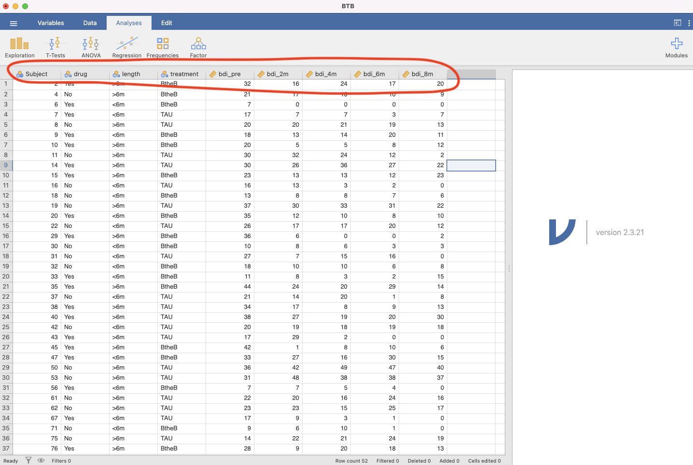


<br>

***   

# 3: Deskriptive Statistik {.tabset}   

## Aufgabe 1   

In kontrollierten Studien ist es wichtig, dass die Gruppen zu Beginn der Studie vergleichbar sind. Berechnen Sie das n, den Mittelwert, den Median, die Standardabweichung das Minimum, das Maximum und die Quartile für die Variable `bdi_pre` separat für die Personen in der BtheB-Gruppe und die Personen in der TAU-Gruppe. Berechnen Sie ebenfalls die absoluten Häufigkeiten für die Variablen `drug` und `length` nach Gruppe.  Sind die Gruppe `BtheB` und die Gruppe `TAU` zu Beginn der Studie vergleichbar in Bezug auf die Variablen `bdi_pre`, `drug` und `length`?   


<br>   

***   

## Lösung 1   


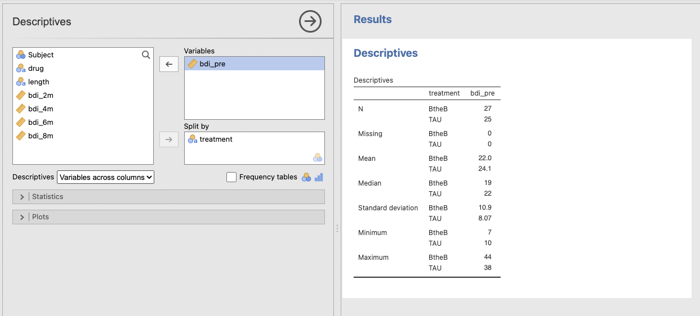   

Die BtheB Gruppe umfasst 27 Personen, die TAU Gruppe 25. Mittelwert (22 vs. 24.1) und Median (19 vs 22) sind in der BtheB Gruppe leicht tiefer als in der TAU Gruppe. Die Werte in der BtheB Gruppe streuen etwas mehr um den Mittelwert als in der TAU Gruppe (Standarabweichung: 10.9 vs 8.07). Die Randomisierung scheint ihren Job gut gemacht zu haben: Die Gruppen sind bzgl. der Variable `bdi_pre` insgesamt vergleichbar. 

<br>   

Durch das Erstellen von Häufigkeitstabellen können die Gruppen bzgl. den Variablen `drug` und `length` verglichen werden. 

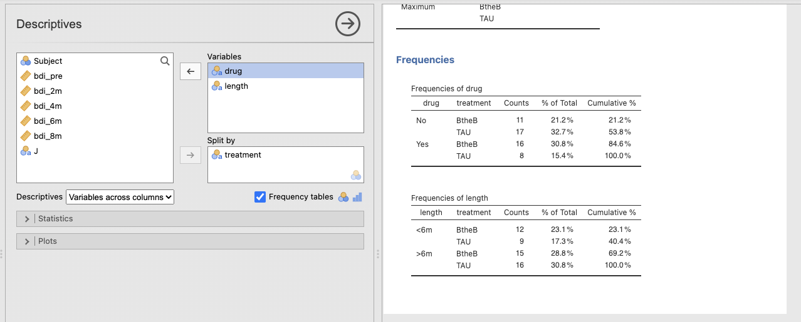

Während es bei der Variable `length` keine grossen Unterschiede gibt, fällt auf, dass in der BtheB Gruppe etwas mehr Leute Antidepressiva einnahmen als in der TAU Gruppe. 

<br>   

***   

## Aufgabe 2   

Erstellen Sie eine Grafik mit Boxplots der Variable `bdi_pre`, sepparat pro Gruppe. Interpretieren Sie die Grafik.   

<br>   

***    

## Lösung 2   


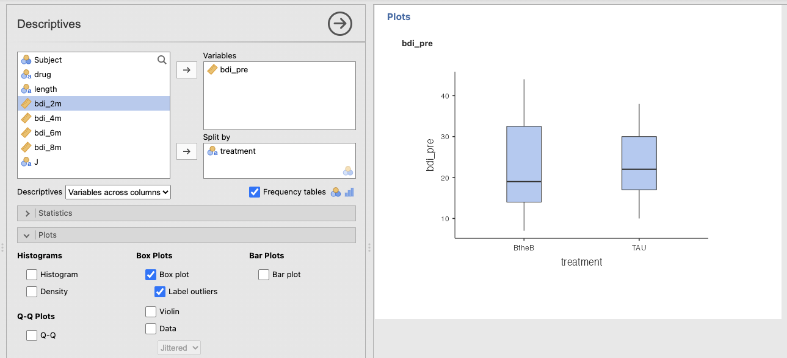

Die Grafik bestätigt die Interpretation oben. Es wird ersichtlich, dass der Median in der TAU Gruppe etwas höher ist und die Werte in der BtheB Gruppe etwas mehr streuen. In beiden Gruppen gibt es keine Ausreisser und keine Werte, die nicht plausibel wären. Insgesamt kann gesagt werden, dass die Gruppen zu Beginn der Studie bzgl. des BDI-Scores vergleichbar sind.   

<br>   

***   

# 4: Erstellen einer neuen Variable {.tabset}   

## Aufgabe 1   

Berechnen Sie eine neue Variable `bdi_diff`, welche die Differenz zwischen der ersten und der letzten Messung darstellt. Rechnen Sie die Differenz so, dass eine positive Zahl eine Verbesserung der Depression bedeutet.   


Anmerkung: Theoretisch könnten Sie dieser neuen Variable einen beliebigen Namen geben. Zur Nachvollziehbarkeit der Aufgaben und Lösungen empfehlen wir jedoch, den Namen `bdi_diff` zu übernhemen.   


<br>   

***   

## Lösung 1   

Durch Klick in eine leere Spalte kann eine neue Variable erstellt werden. Weil wir diese auf Grundlage bereits existierender Variablen erstellen, wählen wir "New computed variable". Danach kann der neue Variablenname und die entsprechende Formel eingegeben werden:

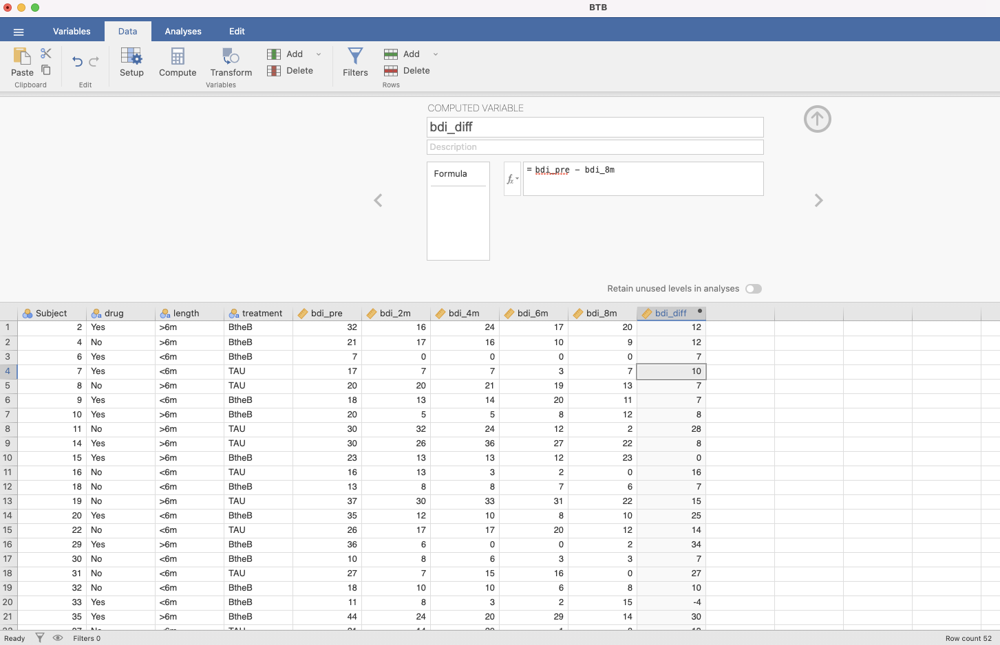
<br>   

***   

## Aufgabe 2   

Um wie viel hat sich die Person in der vierten Zeile (Subject 7) von der Baseline (`bdi_pre`) bis zur letzten Messung (`bdi_8m`) verbessert/verschlechtert?
   
<br>   

***   

## Lösung 2   

Wir sehen, dass sich die Person in der vierten Zeile (Subject 7) um 10 Punkte verbessert hat (der Score nimmt ab, also hat sich die Depression verbessert).   

<br>   

***   

## Aufgabe 3   

Wie gross ist die durchschnittliche Verbesserung in der BtheB Gruppe und in der TAU Gruppe?

<br>   

***    

## Lösung 3   

Im Durchschnitt hat sich der BDI-Score in der BtheB Gruppe um 13.1 Punkte verbessert und in der TAU Gruppe um 10.5 Punkte.      

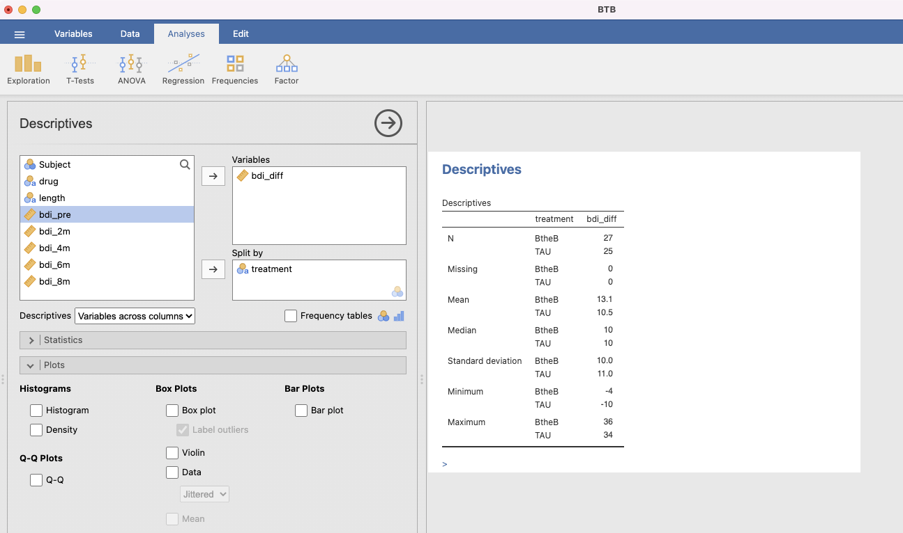   

<br>   

***   

# 5: Veränderung innerhalb der Gruppen {.tabset}   

Untersuchen Sie, ob es Evidenz dafür gibt, dass sich die BDI-Scores innerhalb der Gruppen von der Baseline bis zur Messung nach 8 Monaten verändert haben. Die folgenden Aufgaben beziehen sich sowohl auf die BtheB Gruppe sowie die TAU Gruppe.

## Aufgabe 1

Mit welchem statistischen Test/Verfahren können Sie dies prüfen? Begründen Sie.  


<br>   

***    

## Lösung 1      

In Frage kommt entweder ein t-Test für abhängige Stichproben oder der Wilcoxon-Test. Wir müssen einen Test für abhängige Stichproben wählen, weil die Daten vor und nach der Behandlung von der selben Person stammen. Weil wir die Differenz zwischen `bdi_pre` und `bdi_8m` bereits berechnet haben, können wir auch einen Einstichproben Test mit der Variable `bdi_diff` durchführen (was mathematisch äquivalent ist mit einen Test für abhängige Stichproben).

<br>   

*** 

## Aufgabe 2   

Wie lauten Ihre statistischen Hypothesen? 

<br>   

*** 

## Lösung 2   

Die Nullhypothese sagt in diesem Fall, dass sich der durchschnittliche BDI-Score nicht verändert hat. Mathematisch ausgedrückt:    

$$\mu_{bdi.diff} = 0$$

Die Alternativhypothese lautet folglich:

$$\mu_{bdi.diff} \neq 0$$
Weil es grundsätzlich plausibel ist, dass das Beat the Blues Programm schlechter abschneidet als die Standardtherapie, sollten ungerichtete Hypothesen formuliert werden.   

<br>   

***    

## Aufgabe 3   

Prüfen Sie allfällige Voraussetzungen für ihr vorgesehenes Testverfahren.   

<br>   

***   

## Lösung 3

   
Falls Sie sich für einen t-Test entscheiden, sollten Sie folgendes beachten:    

* Sind die Daten quantitativ skaliert? --> Wenn man ganz streng ist, dann muss man die Frage mit nein beantworten, weil man die echte Distanz zwischen den einzelnen BDI-Werten nicht kennt. Die sogenannte Äquidistanz ist also nicht gegeben (wir können nicht sagen, dass der Unterschied einer Depression von 10 und 15 Punkten gleich gross wie derjenige zwischen 20 und 25 Punkten). In der Forschungspraxis würde den BDI-Score jedoch in den meisten Fällen als quantitative Variable behandeln.    
* Sind die mittleren Differenzen annähernd normalverteilt? Eigentlich können wir das nicht testen. Um einen Anhaltspunkt zu erhalten prüfen wir deshalb, ob die paarweisen Differenzen annähernd normalverteilt sind --> dazu eignet sich die Darstellung mittels QQ-Plot:    

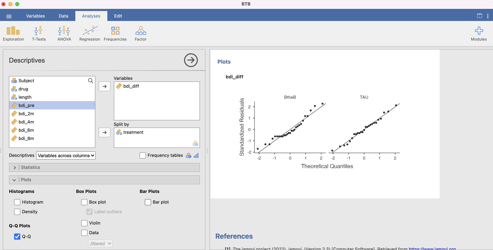


Man sieht, dass die Daten in beiden Gruppen nicht perfekt, aber annähernd einer Normalverteilung folgen.

**Welcher Test soll nun durchgeführt werden?!**

Auf diese Frage gibt es kein Richtig oder Falsch. Weil parametrische Verfahren (also hier der t-Test) gegenüber den nicht-parametrischen Verfahren flexibler sind, werden in der Forschungspraxis deutlich häufiger parametrische Verfahren angewendet (so auch in der Beat the Blues Studie). Fans des zentralen Grenzwertsatz haben ohnehin gute Argumente für parametrische Verfahren. Die Autoren dieser Übung sind der Ansicht, dass in diesem Fall ein t-Test für abhängige Stichproben angemessen ist. Vollständigkeitshalber wird aber auch das nicht-paramtetrische Verfahren (Wilcoxon Test) gezeigt.   

<br>  

***   

## Aufgabe 4    

Führen Sie das Testverfahren für jede Gruppe in jamovi durch und interpretieren Sie das Resultat des statistischen Tests.   

<br>   

***   

## Lösung 4   

Damit die Gruppen separat analysiert werden können, muss zuerst ein Filter definiert werden:   

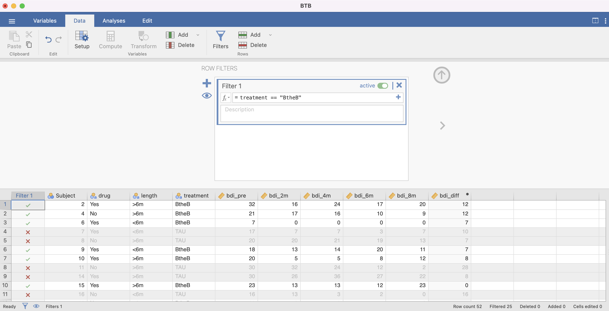   

<br>   


Nun kann der t-Test durchgeführt werden:   

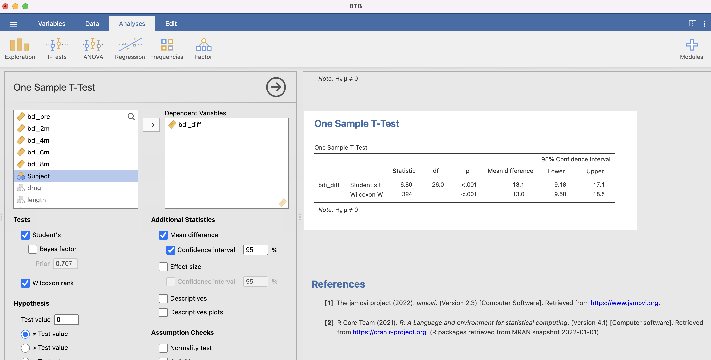   

<br>   

**Interpretation**    

Die mittlere Differenz zwischen den beiden Zeitpunkten beträgt in der BtheB Gruppe 13.1 Punkte. Unter dem Szenario, dass H0 wahr ist, ist die Wahrscheinlichkeit (also der p-Wert), eine Teststatistik t von 6.8 bei einer t-Verteilung mit 26 Freiheitsgeraden zu finden, sehr klein (kleiner als 0.1%). Bei einem Signifikanzniveau von 5% fällt die Teststatistik t somit in den Verwerfungsbereich. Folglich wird H0 zugunsten von HA verworfen.
Wir können zu 95% darauf vertrauen, dass die wahre mittlere Differenz irgendwo zwischen 9.18 und 17.1 Punkten liegt. Die Daten liefern also Evidenz dafür, dass sich der BDI-Score in der TAU Gruppe verbessert.

Der Wilcoxon-Test ist kongruent mit dem t-Test. 

<br>   

Für die TAU-Gruppe ist das Vorgehen analog wie oben bei der BtheB Gruppe.

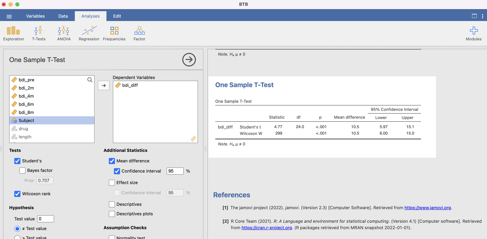   

<br>   

**Interpretation:**

Die mittlere Differenz zwischen den beiden Zeitpunkten beträgt in der TAU Gruppe 10.5 Punkte. Unter dem Szenario, dass H0 wahr ist, ist die Wahrscheinlichkeit (also der p-Werte), eine Teststatistik t von 4.77 bei einer t-Verteilung mit 24 Freiheitsgeraden zu finden, sehr klein (kleiner als 0.1%). Bei einem Signifikanzniveau von 5% fällt die Teststatistik t somit in den Verwerfungsbereich. Folglich wird H0 zugunsten von HA verworfen.
Wir können zu 95% darauf vertrauen, dass die wahre mittlere Differenz irgendwo zwischen 5.97 und 15.1 Punkten liegt. Die Daten liefern also Evidenz dafür, dass sich der BDI-Score in der BtheB Gruppe verbessert.

Der Wilcoxon-Test ist kongruent mit dem t-Test.


<br>   

***    

# 6: Vergleich zwischen den Gruppen {.tabset}   

In der Übung 5 haben Sie in Erfahrung gebracht, dass sie sowohl die BtheB Gruppe (um 13.1 Punkte [95% CI: 9.18 bis 17.1]) sowie die TAU Gruppe (um 10.5 Punkte [95% CI: 5.97 bis 15.1]) statistisch signifikant verbessert haben beim BDI-Score. In dieser Übung geht es nun um die Fragen, ob sich die mittlere Veränderung des BDI-Scores **zwischen** den Gruppen unterscheidet.   
Untersuchen Sie, ob sich die durchschnittliche Veränderung des BDI-Scores zwischen der BtheB Gruppe und der TAU Gruppe unterscheidet.   

## Aufgabe 1
   
Stellen Sie die Variable `bdi_diff` mittels Boxplots separat pro Gruppe dar. Würden Sie aufgrund dieser Darstellung einen statistisch signifikanten Unterschied zwischen den Gruppen erwarten? Mit welchem statistischen Test/Verfahren können Sie dies prüfen?   


<br>   

***   


## Lösung 1   

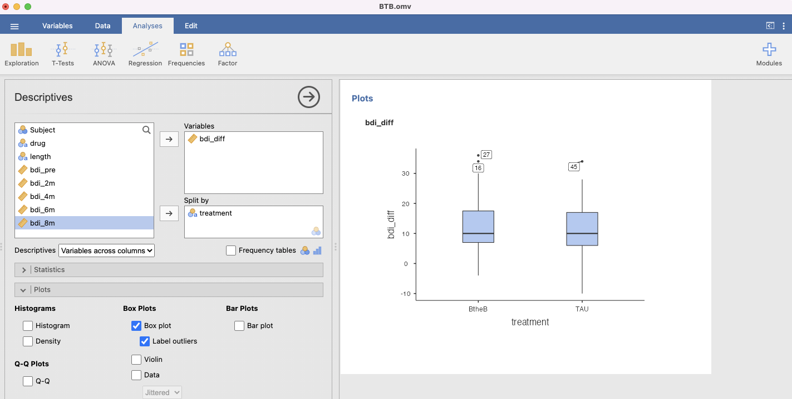   

<br>   

Anhand der Grafik oben würde man kaum annehmen, dass sich die durchschnittliche Veränderung zwischen den Gruppen unterscheidet. Um dies mit einem statistischen Test zu überprüfen, kommt entweder ein t-Test für unabhängige Stichproben oder der Mann-Withney U Test in Frage. Wir müssen einen Test für unabhängige Stichproben wählen, weil die Daten in der BthB Gruppe unabhängig von jenen in der TAU Gruppe sind.   

<br>  

***   

## Aufgabe 2   

Wie lauten Ihre statistischen Hypothesen?   


<br>  

***   

## Lösung 2   

Die Nullhypothese sagt in diesem Fall, dass sich die mittlere Differenz des BDI-Scores zwischen der BtheB Gruppe und der TAU Gruppe nicht unterscheidet. Mathematisch ausgedrückt:    

$$\mu_{bdi.diff(BtheB)} = \mu_{bdi.diff(TAU)} $$

Die Alternativhypothese lautet folglich:

$$\mu_{bdi.diff(BtheB)} \neq \mu_{bdi.diff(TAU)}$$
Weil es grundsätzlich plausibel ist, dass das Beat the Blues Programm schlechter abschneidet als die Standardtherapie, sollten ungerichtete Hypothesen formuliert werden.   

<br>

***    

## Aufgabe 3   

Prüfen Sie allfällige Voraussetzungen für ihr vorgesehenes Testverfahren.  

<br>  

***   

## Lösung 3 

  
Falls Sie sich für einen t-Test entscheiden, sollten Sie folgendes beachten:    

* Sind die Daten quantitativ skaliert? --> Wenn man ganz streng ist, dann muss man die Frage mit nein beantworten, weil man die echte Distanz zwischen den einzelnen BDI-Werten nicht kennt. Die sogenannte Äquidistanz ist nicht also nicht gegeben (wir können nicht sagen, dass der Unterschied einer Depression von 10 und 15 Punkten gleich grosse wie derjenige zwischen 20 und 25 Punkten). Oft werden in der Forschungspraxis solche Scores dennoch als quantitative Variablen behandelt (man konnte zeigen, dass dies die Analyse nicht verfälscht).  
* Sind die Mittelwertsdifferenzen annähernd normalverteilt? --> Eigentlich können wir das nicht prüfen. Um jedoch einen Anhaltspunkt zu erhalten, schauen wir, ob die Variable `bdi_diff` in den beiden Gruppen annähernd normalverteilt ist. Die Darstellung erfolgt am einfachsten mittels QQ-Plot:    


Man sieht, dass die Daten nicht perfekt, aber annähernd eine Normalverteilung folgen.

**Welcher Test soll nun durchgeführt werden?!**

Auf diese Frage gibt es kein Richtig oder Falsch. Weil parametrische Verfahren (also hier der t-Test für unabhängige Stichproben) gegenüber den nicht-parametrischen Verfahren flexibler sind, werden in der Forschungspraxis deutlich häufiger parametrische Verfahren angewendet (so auch in der Beat the Blues Studie). Fans des zentralen Grenzwertsatz haben ohnehin gute Argumente für parametrische Verfahren. Die Autoren dieser Übung sind der Ansicht, dass in diesem Fall ein t-Test für unabhängige Stichproben angemessen ist. Vollständigkeitshalber wird aber auch das nicht-paramtetrische Verfahren (Mann-Withney U Test) gezeigt.   

<br>   

***   

## Aufgabe 4   

Führen Sie das Testverfahren in jamovi durch und interpretieren Sie das Resultat des statistischen Tests.  

<br>  

***   

## Lösung 4 


Der Output des t-Tests für unabhängige Stichproben sieht wie folgt aus:   

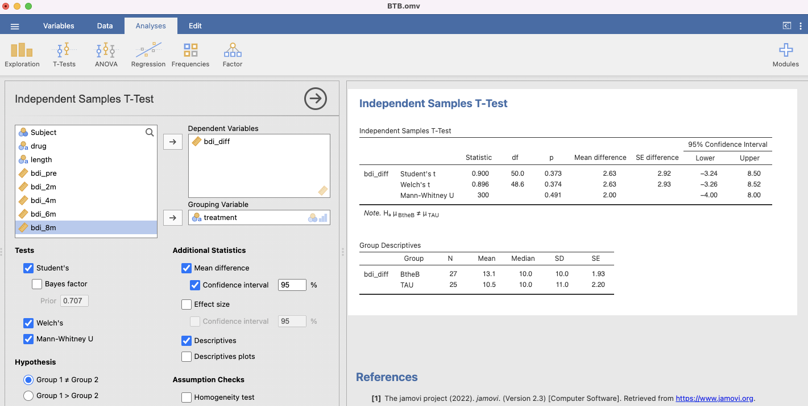   

<br>   

**Interpretation**    

Die Mittelwertsdifferenz zwischen den Gruppen beträgt 2.63 Punkte. Unter dem Szenario, dass H0 (Mittelwertsdifferenz = 0) wahr ist, ist die Wahrscheinlichkeit (also der p-Wert), eine Teststatistik t von 0.9 bei einer t-Verteilung mit 50 Freiheitsgeraden zu finden, relativ gross (37.3%). Bei einem Signifikanzniveau von 5% fällt die Teststatistik t somit nicht in den Verwerfungsbereich. Folglich liefern die Daten keine Evidenz gegen H0 und wir verwerfen H0 deshalb nicht.   
Wir können zu 95% darauf vertrauen, dass die wahre Mittelwertsdifferenz irgendwo zwischen -3.24 und 8.5 Punkten liegt. Da das Intervall breit ist und sowohl negative (TAU ist besser) wie auch positive (BtheB ist besser) Werte beinhaltet, liefern die Daten keine Evidenz dafür, dass sich die durchschnittliche Verbesserung des BDI-Scores in der BtheB Gruppe und der TAU Gruppe unterscheidet.

Der Welch's t-Test korrigiert für die Tatsache, dass die Standardabweichungen der beiden Gruppen nicht ganz genau gleich sind. Das Ergebnis unterscheidet sich jedoch kaum vom normalen t-Test. Auch das nicht-parametrische Verfahren, der Mann-Withney U Test, führt zur selben Interpretation. Der Eindruck, welcher durch die Betrachtung der Boxplots entstand, hat also nicht getäuscht (es lohnt sich immer, zuerst grafische Eindrücke zu sammeln!).    


<br>   


***    

# 7: Zusammenhang zwischen Baseline-Score und Veränderung des BDI-Scores {.tabset}   


Es stellt sich die Frage, ob es einen Zusammenhang gibt zwischen dem Schweregrad der Depression zu Beginn der Studie (`bdi_pre`) und der Veränderung des BDI-Scores (`bdi_diff`). Um diese Frage zu beantworten, wurde die folgende einfache lineare Regression berechnet:   

{width=70%}

<br>   

## Aufgabe 1    

Reproduzieren Sie die lineare Regression in jamovi.   
  
  
<br>   

***   

## Lösung 1  

Sie können das lineare Regressionsmodell wie folgt in jamovi berechnen lassen:   

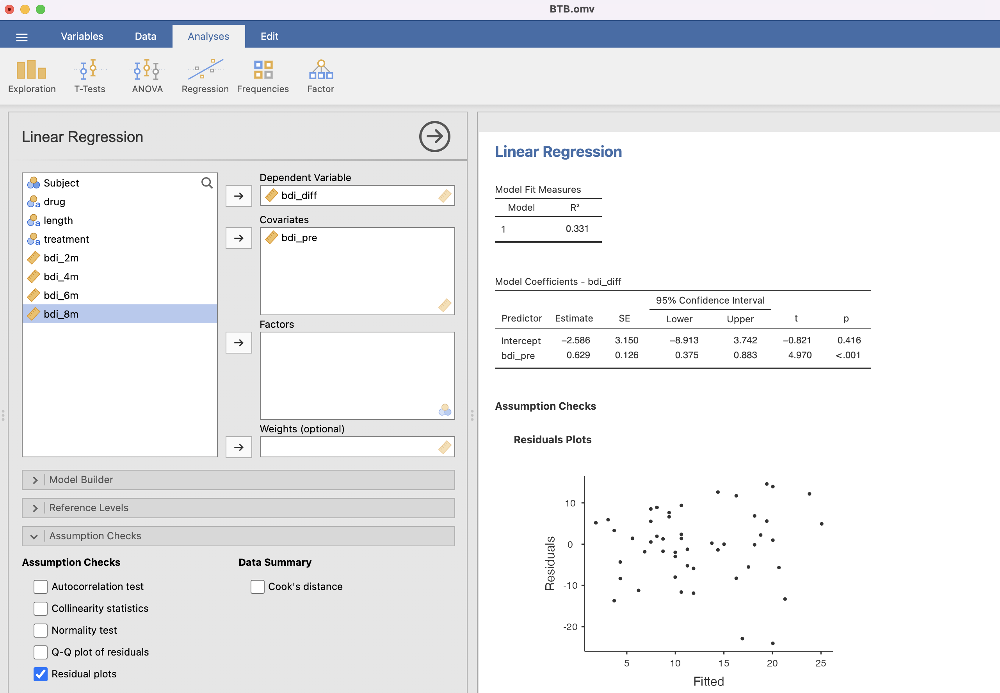

<br>   

## Aufgabe 2   

Beurteilen Sie für alle folgenden Aussagen, ob diese zutreffen oder nicht und begründen Sie ihre Entscheidung:     

1. Die Variable `bdi_pre` ist die abhängige Variable. 
2. Zwischen `bdi_pre` und `bdi_diff` besteht ein positiver, linearer Zusammenhang.  
3. Der Korrelationskoeffizient nach Pearson ist $r = 0.331$.   
4. Die Nullhypothese für die Frage nach dem Zusammenhang zwischen `bdi_pre` und `bdi_diff` lautet $H_0: \beta_0 = 0$.   
5. Die Alternativhypothese für die Frage nach dem Zusammenhang zwischen `bdi_pre` und `bdi_diff` lautet $H_A: \beta_1 \neq 0$.  
6. $\beta_0$ ist der durchschnittliche BDI-Score zur Baseline der Studie.  
7. $\beta_1$ ist der Steigungsparameter und beschreibt den Zusammenhang zwischen `bdi_pre` und `bdi_diff.`
8. Je tiefer der Schweregrad zu Beginn der Studie, desto grösser die Verbesserung des BDI-Scores.   
9. Das Modell schätzt für eine Person, welche zu Beginn der Studie einen BDI-Score von 30 hat, eine durchschnittliche Verbesserung von 16.3 Punten.      
10. Die Variable `bdi_pre` erklärt ca. einen Drittel der Variabilität der Variable `bdi_diff`.    
11. Die Daten zeigen Evidenz dafür, dass sich die Steigung der Regressionsgeraden $\beta_1$ signifikant von Null unterscheidet.   
12. Die Residuen sind homogen um 0 verteilt.      
13. Sind die Voraussetzungen für eine lineare Regression verletzt, könnte alternativ der Korrelationskoeffizient nach Spearman berechnet werden, um einen Zusammenhang zwischen `bdi_pre` und `bdi_diff` zu analysieren.  
    
<br>   

***   

## Lösung 2 


**Beurteilung der Aussagen zur obigen lineare Regression:**   

1. Die Variable `bdi_pre` ist die abhängige Variable. Diese Aussage ist **FALSCH.** In diesem Modell ist die Variable `bdi_pre` die unabhängige Variable (auch Prädiktorvariable genannt) und die Variable `bdi_diff` ist die abhängige Variable.    

***    

2. Zwischen `bdi_pre` und `bdi_diff` besteht ein positiver, linearer Zusammenhang. Diese Aussage ist **KORREKT**. Wenn man die beiden Variablen in einem Streudiagramm darstellt, ist ein positiver, linearer Zusammenhang vertretbar. Es gibt zwei Personen (die Punkte unten rechts), welche etwas von diesem Muster abweichen.    


***   

3. Der Korrelationskoeffizient nach Pearson ist $r = 0.331$. Diese Aussage ist **FALSCH**. 0.331 ist nicht der Korrelationskoeffizient nach Pearson, sondern $R^2$, also das Bestimmtheitsmass. Der Korrelationskoeffizient nach Pearson $r = \sqrt{R^2} = 0.575$.    

***   

4. Die Nullhypothese für die Frage nach dem Zusammenhang zwischen `bdi_pre` und `bdi_diff` lautet $H_0: \beta_0 = 0$. Diese Aussage ist **FALSCH**. Nicht $\beta_0$, sondern $\beta_1$ beschreibt den Zusammenhang zwischen `bdi_pre` und `bdi_diff`. Folglich lautet die Nullhypothese $H_0: \beta_1 = 0$.      

***    

5. Die Alternativhypothese für die Frage nach dem Zusammenhang zwischen `bdi_pre` und `bdi_diff` lautet $H_A: \beta_1 \neq 0$. Diese Aussage ist **KORREKT**. $\beta_1$ beschreibt die Steigung, also um wie viel sich bdi_diff durchschnittlich erhöt, wenn sich bdi_pre um einen Punkt erhöt. Wenn $\beta_1 = 0$ bedeutet dies, dass kein Zusammenhang zwischen den Variablen besteht.   

***   

6. $\beta_0$ ist der durchschnittliche BDI-Score zur Baseline der Studie. Diese Aussage ist **FALSCH**. $\beta_0$ ist in diesem Fall inhaltlich nicht sinnvoll interpretierbar. Es wäre der durchschnittliche Wert von `bdi_diff`, wenn die Variable `bdi_pre` den Wert 0 annimmt. Für solche Personen ist das Modell jedoch nicht aussagekräftig, weil Personen ohne Depression nicht zur untersuchten Population gehören.   

***   

7. $\beta_1$ ist der Steigungsparameter und beschreibt den Zusammenhang zwischen `bdi_pre` und `bdi_diff.` Diese Aussage ist **KORREKT**. $\beta_1$ beschreibt die Steigung, also um wie viel sich bdi_diff durchschnittlich erhöt, wenn sich bdi_pre um einen Punkt erhöt.   

***    

8. Je tiefer der Schweregrad zu Beginn der Studie, desto grösser die Verbesserung des BDI-Scores. Diese Aussage ist **FALSCH**. Weil $\beta_1$ eine positove Zahl ist, ist auch der Zusammenhang positiv: Je *höher* der Schweregrad zu Beginn der Studie, desto *grösser* die Verbesserung des BDI-Scores.   

***   

9. Das Modell schätzt für eine Person, welche zu Beginn der Studie einen BDI-Score von 30 hat, eine durchschnittliche Verbesserung von 16.3 Punkten. Diese Aussage ist **KORREKT**. Die Regressionsformel lautet $\beta_0 + \beta1 * x = -2.586 + 0.629 * 30 = 16.284$.   

***   

10. Die Variable `bdi_pre` erklärt ca. einen Drittel der Variabilität der Variable `bdi_diff`. Diese Aussage ist **KORREKT**. Der Anteil der durch die unabhängige Variable `bdi_pre` erklärte Variabilität der abhängigen Variable `bdi_diff` gibt uns das Bestimmtheitsmass an: $R^2 = 0.331 = 33.1%$.   

***   

11. Die Daten zeigen Evidenz dafür, dass sich die Steigung der Regressionsgeraden $\beta_1$ signifikant von Null unterscheidet. Diese Aussage ist **KORREKT**. Der kleine p-Wert (<0.001) bedeutet, dass die Daten nicht kompatibel mit $H_0$ sind. Folglich wird $H_0$ verworfen zugunsten von $H_1: \beta_1 \neq 0$.   

***   

12. Die Residuen sind homogen um 0 verteilt. Diese Aussage ist **FALSCH**. Wenn man den Residuenplot anschaut sieht man, dass das Modell bei tiefen Werten diese eher unterschätzt und hohe Werte eher überschätzt: Bei tiefen geschätzten Werten sind die Residuen eher negativ und bei hohen geschätzen Werten sind die Residuen eher posisitv. Somit sind die Residuen nicht homogen um 0 vertteilt.   

***   

13. Sind die Voraussetzungen für eine lineare Regression verletzt, könnte alternativ der Korrelationskoeffizient nach Spearman berechnet werden, um einen Zusammenhang zwischen `bdi_pre` und `bdi_diff` zu analysieren. Diese Aussage ist **KORREKT**.       


# 8. Klinisch relevante Veränderung {.tabset}   

Ein [Studie](https://www.cambridge.org/core/journals/psychological-medicine/article/minimal-clinically-important-difference-on-the-beck-depression-inventory-ii-according-to-the-patients-perspective/9672DAAEECECA90E73A518676A00D844) hat untersucht, wie gross die Reduktion des BDI's sein muss, damit man von einer klinisch relevanten Veränderung ausgehen kann (minimal clinically important difference, MCID). Die Autor:innen kommen zum Schluss, dass sich Personen, welche noch nicht lange an Depression leiden, um 17.5% verbessern müssen. Personen, welche schon länger an Depression leiden, benötigen eine 32%-ige Verbesserung.

Um die Übung zu vereinfach, soll untersucht werden, wie viele Leute in jeder Gruppe sich um mindestens 17.5% verbessert haben.   


## Aufgabe 1     

Erstellen Sie eine neue Variable `mcid`. Diese Variable soll angeben, ob jemand die MCID erreicht hat oder nicht. Das erreichen Sie, indem Sie eine Bedingung aufstellen:   

$$bdi_{diff} > bdi_{pre} * 0.175$$

<br>  

***   

## Lösung 1   

Wenn Sie auf "Compute" klicken, können Sie eine neue Variable berechnen. Wenn Sie die Formel   

$$bdi_diff > bdi_pre * 0.175$$   

eingeben, wird die Variable erstellt, welche die Ausprägung `true` annimmt, wenn die MCID erreicht wurde und `false`, wenn diese nicht erreicht wurde.   


<br>   

***   

## Aufgabe 2   

Berechnen Sie die Häufkeiten der Variable `mcid` pro Gruppe. Was stellen Sie fest?   

<br>   

***   


## Lösung 2   

Da es sich bei der Variable `mcid` um eine qualitative Variable handelt, macht nur die Berechnung von Häufigkeiten Sinn (Mittelwert usw. wurde deshalb nicht ausgewählt, dafür der Haken bei "Frequency tables" gesetzt).   


In der BthtB Gruppe haben 3 von 27 (11.1%) und in der TAU Gruppe 6 von 25 (24%) Personen die MCID nicht erreicht.   

<br>   

***   

## Aufgabe 3   

Mit welchem statistischen Verfahren könnten analysieren, ob die in Aufgabe 2 gefundenen Unterschiede statistisch signifikant sind? Wie lauten die statistischen Hypothese zu diesem Test? Was sind die Voraussetzungen für diesen Test?

<br>   

***   

## Lösung 3   

Eine Möglichkeit, um die Unabhängigkeit zweier nominaler Variablen zu testen, ist der Chi-Quadrat Test. Dabei werden die folgenden Hypothesen aufgestellt:  

$𝐻_0$: Die zwei Variablen sind unabhängig    


$H_𝐴$:Die zwei Variablen sind abhängig   

Für einen Chi-Quadrat Test sollte die erwartete Häufigkeit in keine Zelle kleiner als 5 sein. Ansonsten sollte der Fisher-Test verwendet werden.   


<br>   

***   

## Aufgabe 4   

Führen Sie einen Chi-Quadrat (oder ggf. einen Fisher-Test) durch und interpretieren Sie das Resultat.   

<br>   

***   

## Lösung 4   

Um den Chi-Quadrat Test durchzuführen, werden die Variablen `mcid` und `treatment` ausgewählt. Damit entschieden werden kann, ob die Voraussetzung bzgl. den erwarteten Häufigkeiten erfüllt ist, werden diese auch ausgewählt.   

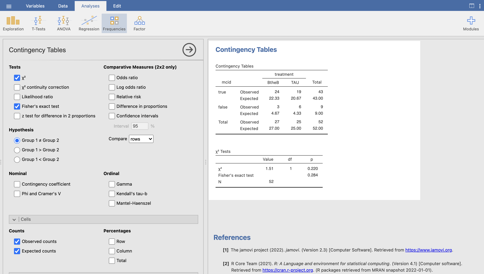
<br>   

Die erwarteten Häufigkeiten entsprechen quasi der Nullhypothese, also dass es keinen Zusammenhang zwischen Gruppe und der Anzahl Personen gibt, welche die MCID erreichen, bzw. nicht erreichen. Und $H_0$ wird erwartet, dass in der BtheB Gruppe 4.67 und in der TAU Gruppe 4.33 Personen die MCID nicht erreichen. Unsere beobachteten Häufigkeiten weichen nur geringfügig von den erwarteten Häufigkeiten ab. Somit besteht wenig Evidenz gegen $H_0$. Das bestätig der hohe p-Wert: dieser beträgt 28.4%. Wir interpretieren den p-Wert des Fisher-Tests, weil die erwarteten Häufigkeiten in zwei Zellen knapp kleiner sind als 5. Wir können also keinen Zusammenhang zwischen Gruppe und dem erreichen der MCID nachweisen. Somit ist der Chi-Quadrat Test kongruent zum t-Test für unabhängige Stichproben.   

<br>   

***   

# 9 Fazit   

Wir haben gesehen, dass sich zwar beide Gruppen statistisch signifikant verbessern, jedoch zwischen den Gruppen keine statistisch signifikanten Unterschiede festgestellt werden konnten (sowohl beim t-Test sowie beim Chi-Quardrat Test). Dieses Phänomen ist bei Interventionsstudien im Gesundheitssektor gang und gägbe. Der Faktor "Zeit" ist also nicht zu unterschätzen. Nicht selten setzt man genau dann eine Intervention an, wenn das Problem am schlimmsten ist. In vielen fällen ist es dann nicht mehr als logisch, dass man sich verbessert (Regression to the mean). Genau aus diesem Grund ist es so wichtig, dass man eine Intervention wenn immer möglich mit einer Kontrollintervention vergleicht. Durch eine Randomisierung erreicht man am ehesten, dass die Gruppen zu Beginn der Studie vergleichbar sind. Bei dieser Teilstichprobe, war dies der Fall.

Falls Sie die Originalstudie gelesen haben wird Ihnen aufgefallen sein, dass dort von einem "statistisch signifikanten" Unterschied zwischen den Gruppen die Rede ist. Haben Sie in dieser Übung nun doch alles falsch gerechnet? Nein! Es gibt mehrere Gründe, warum die Originalstudie zu (leicht) unterschiedlichen Resultaten kommt:   

* Wir verfügen nur über einen Teildatensatz. Die Stichprbengrösse in der publizierten Studie ist fast doppelt so gross. Dies führt zu einer erheblich grösseren statistischen Power: Aufgrund des Wurzel-n-Gesetztes wissen wir, dass mit grössererm Stichprobenumfang der Standardfehler kleiner wird. Heisst: Bei gleichem Effekt werden Vertrauensintervalle schmaler, Teststatistiken grösser und p-Werte somit kleiner und schneller signifikant.   

* In der Studie wurde eine andere Analyse durchgefüht. Sie haben sicher gesehen, dass der BDI auch nach zwei, vier und sechs Monaten gemessen wurden. Im statistischen Modell der Autor:innen (einem soganannten mixed effects model) wurden alle Zeitpunkte berücksichtig. Weil die BtheB Gruppe bei allen Zeitpunkten leicht besser war als die TAU Gruppe, erhöht das die Wahrscheinlichkeit, dass man insgesamt einen p-Wert unter 5% findet.   

* In der Studie wurde mit dem effektiven BDI-Wert gerechnet, wir haben mit der Differenz (vorher-nachher) gererchnet. Das Rechnen mit der Differenz bietet den Vorteil, dass dadurch automatisch für die Baseline adjustiert wird!   

* In der Studie wird der Zeitpunkt nach 8 Monaten nur halbpatzig berücksichtig (siehe z.B. Tabelle unten). Warum wohl? Wenn sie einen t-Test machen für den BDI-Score nach 6 Monaten werden Sie einen signifikanten Unterschied zwischen den Gruppen feststellen, jedoch nicht nach 8 Monaten!

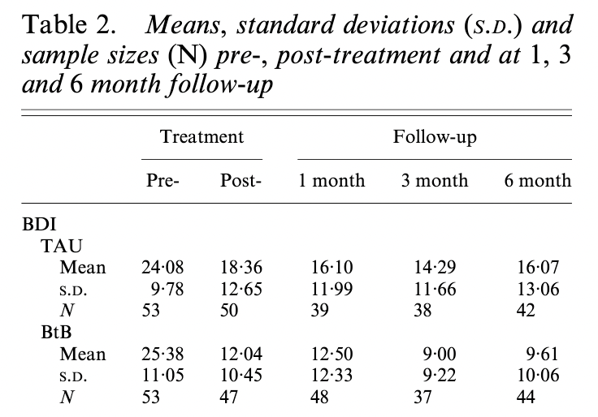{width=50%}


